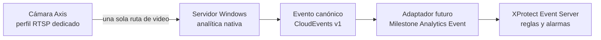
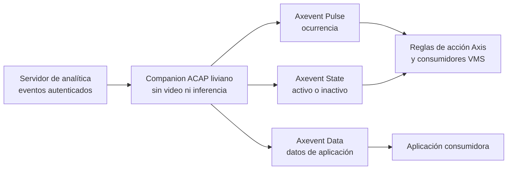
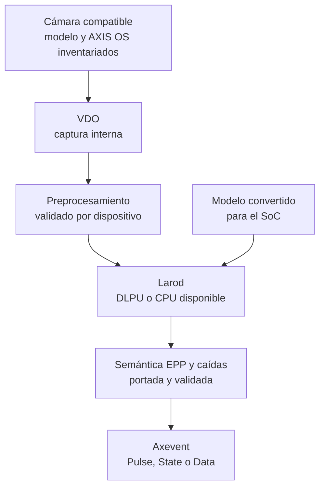

# Evaluación de integrabilidad con Axis ACAP

**Decisión actual:** no se afirma compatibilidad ACAP para las cámaras de Cuajone
sin inventario de hardware y AXIS OS. El piloto recomendado mantiene la analítica
en Windows, consume un único perfil RTSP dedicado por cámara y envía Milestone
Analytics Events. ACAP queda como una línea de producto separada.

Documentación oficial revisada: **2026-07-29**.

## Qué se puede reutilizar

La arquitectura implementada separa elementos portables de componentes ligados a
Windows y NVIDIA.

| Elemento | Reutilización en ACAP |
| --- | --- |
| Contratos JSON v1 | Sí. Son la frontera de intercambio y validación. |
| CloudEvents y esquema canónico de eventos | Sí. Un bridge puede validarlos y mapearlos a eventos Axis. |
| Etiquetas y defaults versionados | Sí, después de comprobar que el modelo convertido conserva las mismas clases y umbrales. |
| Semántica determinista de tracking, EPP y caídas | Portable como especificación de comportamiento. El código debe recompilarse y validarse para el SDK objetivo. |
| Fixtures y vectores sintéticos | Sí, cuando no dependan de CUDA, TensorRT, Windows ni datos operativos. |
| Servicio Windows futuro, MSI y binario x64 | No. ACAP usa paquetes Linux ARM `.eap` compilados para el SoC de la cámara. |
| CUDA y TensorRT | No directamente. La ruta edge usa los backends admitidos por el dispositivo, normalmente Larod y DLPU o CPU. |
| Credential Manager o DPAPI | No. Cualquier diseño futuro basado en esas APIs sería exclusivo de Windows; el repositorio no las implementa hoy. |
| OpenCV/FFmpeg desktop empaquetados en el MSI | No directamente. Dependencias y captura deben resolverse con el SDK y las APIs disponibles en la cámara. |
| Binding `pybind11`, Python, CVAT y Supervision | No. Son herramientas de desarrollo/QA y no forman parte del runtime ni del MSI. |

Reutilizar la semántica NO demuestra que el binario actual pueda instalarse en una
cámara. Contrato portable y artefacto portable son problemas distintos.

## Arquitectura central recomendada

El servidor conserva el runtime ya construido. El adaptador de red hacia Milestone
aún no está implementado; el objetivo es que publique eventos deduplicados. No se
debe alimentar el mismo worker desde RTSP directo y desde otra ruta VMS/bridge:
duplicaría tráfico, decodificación y alertas.

## Opción A: companion ACAP liviano

Un companion liviano no captura video ni ejecuta inferencia. Recibe eventos del
servidor por un transporte autenticado aprobado por TI, valida contrato, versión,
secuencia y deduplicación, y los traduce a `Axevent`:

- `Pulse` para una ocurrencia puntual que puede disparar una regla de acción;
- `State` para una condición activa/inactiva, por ejemplo mientras una alarma
  permanezca activa;
- `Data` para información que deba consumir otra aplicación, no como sustituto
  automático de una regla genérica.

Esta opción reutiliza contratos y eventos, pero sigue requiriendo una aplicación
`.eap`, autenticación, autorización, protección contra replay, mapeo por cámara y
pruebas por modelo/AXIS OS. No está implementada en este repositorio.

## Opción B: inferencia ACAP completa

La inferencia edge es otro producto, no una recompilación del MSI. Requiere ACAP
Native o Computer Vision SDK según el dispositivo soportado, captura VDO,
preprocesamiento compatible, Larod, DLPU cuando exista y modelos convertidos para
el SoC exacto.

La carga exitosa de un modelo convertido no valida precisión, memoria, temperatura
ni estabilidad. Deben repetirse paridad, exactitud y pruebas prolongadas por cada
familia de dispositivo.

## Gate de inventario

No se diseña ni promete un `.eap` hasta registrar, por cámara:

| Dato obligatorio | Decisión que habilita |
| --- | --- |
| Modelo y número de producto exactos | Confirma soporte ACAP y funciones físicas. |
| AXIS OS, release track y LTS | Selecciona SDK y ventana de compatibilidad. |
| SoC y arquitectura | Selecciona `armv7hf` o `aarch64` y la conversión del modelo. |
| Compatibilidad de APIs ACAP | Confirma Axevent, VDO, Larod y APIs auxiliares. |
| DLPU o backend de inferencia | Define aceleración y formatos admitidos. |
| RAM, almacenamiento y límites de aplicación | Determina si runtime y modelo caben con margen. |
| Analíticas ya instaladas | Evita competencia de recursos, eventos u overlays duplicados. |
| Mapeo de cámara y eventos en el VMS | Define correlación, reglas, retención y operación. |

## Matriz de decisión

Escala: `1` desfavorable, `5` favorable. Los pesos reflejan el estado actual del
proyecto, no una evaluación universal. Puntaje final = suma ponderada sobre 5.

| Criterio | Peso | Servidor central | Companion ACAP | ACAP edge completo |
| --- | ---: | ---: | ---: | ---: |
| Reutilización de lo implementado | 25% | 5 | 4 | 2 |
| Tiempo y complejidad de entrega | 20% | 5 | 3 | 1 |
| Independencia del hardware de cámara | 15% | 4 | 2 | 1 |
| Simplicidad operativa | 15% | 4 | 3 | 3 |
| Operación sin servidor | 10% | 1 | 1 | 5 |
| Integración con reglas Axis | 10% | 2 | 5 | 5 |
| Evidencia y pruebas disponibles hoy | 5% | 5 | 2 | 1 |
| **Puntaje ponderado** | **100%** | **4.00** | **3.05** | **2.35** |

El servidor central gana para el piloto porque maximiza reutilización y evidencia.
El companion tiene sentido solo si una regla local Axis aporta un resultado
operativo concreto. El edge completo se evalúa cuando el inventario demuestre
capacidad y exista una necesidad de operación sin servidor que compense su costo.

## Fuentes oficiales

- [Documentación ACAP](https://developer.axis.com/acap/)
- [APIs soportadas, incluidos Axevent, Larod y VDO](https://developer.axis.com/acap/reference/supported-apis/)
- [Compatibilidad de dispositivos y AXIS OS](https://developer.axis.com/acap/reference/axis-devices-and-compatibility/)
- [Lenguajes soportados por ACAP Native SDK](https://developer.axis.com/acap/reference/supported-languages/)
- [Guía de compatibilidad de APIs](https://developer.axis.com/acap/reference/supported-apis/api-compatibility-guide/)
- [Build, instalación y paquete ACAP](https://developer.axis.com/acap/how-to-guides/build-install-run/)
- [Ejemplos oficiales de Axevent](https://github.com/AxisCommunications/acap-native-sdk-examples/tree/main/axevent)
- [Ejemplo oficial VDO y Larod](https://github.com/AxisCommunications/acap-native-sdk-examples/tree/main/vdo-larod)
- [ACAP Computer Vision SDK examples](https://github.com/AxisCommunications/acap-computer-vision-sdk-examples)
- [Ejemplo Milestone Analytics Event XML](https://github.com/milestonesys/mipsdk-samples-protocol/tree/main/TriggerAnalyticsEventXML)

La compatibilidad debe volver a revisarse durante el inventario: que una API figure
para un chip no garantiza que la función subyacente exista en un producto concreto.
