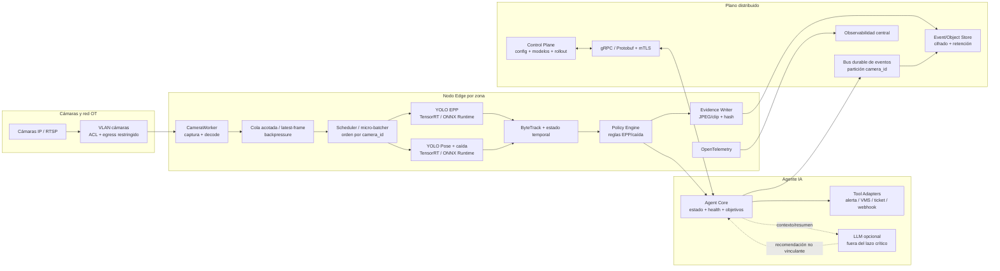
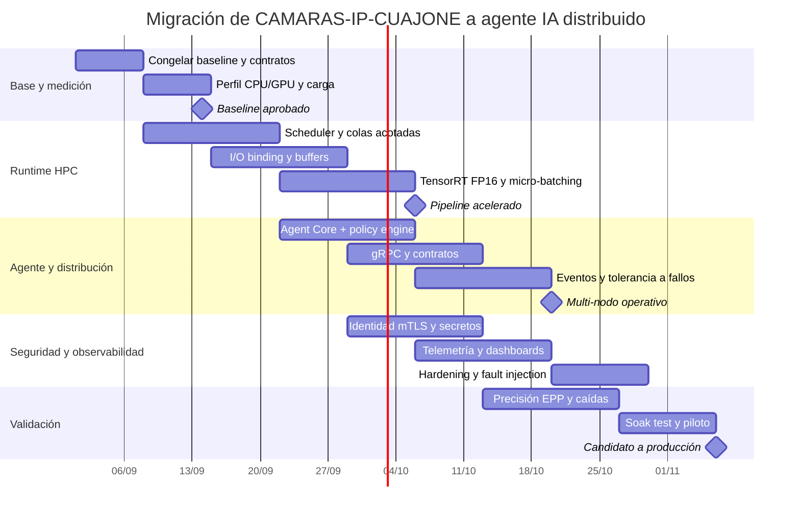

# Optimización HPC y conversión de CAMARAS-IP-CUAJONE en un agente IA distribuido para detección de EPP y caídas

## Resumen ejecutivo

El repositorio indicado en la solicitud contiene un error tipográfico: `CAMARAS-IP-CUAJONEarma` no corresponde al repositorio localizado; el análisis se realizó sobre **`jeanpaulandradeleiva-crypto/CAMARAS-IP-CUAJONE`**, cuya rama principal contiene el runtime C++, modelos y herramientas descritos a continuación. fileciteturn3file0L2-L2

La principal conclusión es que **no conviene reescribir el proyecto desde cero ni “convertir Python a C++”**, porque el repositorio ya tiene una arquitectura nativa C++ bastante avanzada. La ruta de producción es MSI → NexoAI Vision Launcher → `NexoAIVision.exe`; Python, PyTorch y Ultralytics están fuera del runtime de producción. El proyecto ya dispone de ONNX Runtime CPU/CUDA, TensorRT, ByteTrack, analítica EPP, analítica temporal de caídas, contratos JSON versionados, telemetría de rendimiento, límites de recursos, pruebas C++/Python, manejo de evidencia, firma del instalador y almacenamiento seguro de las credenciales RTSP. fileciteturn4file0L2-L2 fileciteturn5file0L2-L2

Además, el código actual está más adelantado que algunas descripciones iniciales del README: `engine_pipeline.cpp` ya contiene un `PoseExecutor` dedicado para solapar pose con PPE en la ruta híbrida y una ruta de solapamiento de dos inferencias TensorRT condicionada al hardware; al mismo tiempo, `process()` conserva un `process_mutex`, por lo que una **instancia individual** del pipeline sigue siendo serializada desde el punto de vista de llamadas concurrentes. Eso hace que la siguiente optimización de gran impacto sea escalar mediante **múltiples workers/pipelines por cámara o GPU, scheduling y micro-batching**, no simplemente agregar más `std::thread`. fileciteturn8file0L2-L2 fileciteturn9file0L2-L2

La arquitectura objetivo que recomiendo es un **agente IA híbrido edge/distribuido**:

1. El video y los tensores permanecen, por defecto, en nodos edge próximos a las cámaras.
2. C++ mantiene el camino crítico: captura → preprocessing → YOLO EPP/pose → tracking → reglas temporales.
3. Un `Agent Core` recibe resultados estructurados, mantiene estado y health por cámara, ejecuta políticas y activa herramientas.
4. El escalamiento horizontal se realiza particionando por `camera_id`.
5. gRPC/Protobuf se utiliza para control y administración; un bus durable de eventos se emplea para eventos de seguridad.
6. Un LLM puede añadirse para resumir incidentes, consultar estados o asistir al operador, pero **no debe ser requisito para determinar una caída o incumplimiento de EPP**.
7. Antes de cualquier optimización se establece una línea base reproducible con p50/p95/p99, FPS, CPU, GPU, VRAM, memoria y métricas de precisión. NVIDIA recomienda precisamente comenzar con profiling del sistema, localizar el limitante principal y volver a medir después de cada cambio. citeturn4search0turn4search9

La estimación de implementación es de aproximadamente **280–440 horas de ingeniería**, excluyendo un reentrenamiento grande, adquisición de GPU/servidores, integración contractual con un VMS concreto y actividades legales o de privacidad.

**Entregables descargables generados:**

- [Descargar informe Markdown OpenSpec](sandbox:/mnt/data/cuajone_ai_agent_openspec/CAMARAS_IP_CUAJONE_AI_AGENT_OPEN_SPEC.md)
- [Descargar bundle completo OpenSpec + Mermaid + scripts](sandbox:/mnt/data/CUAJONE_AI_AGENT_OPEN_SPEC_BUNDLE.zip)
- [Descargar arquitectura Mermaid](sandbox:/mnt/data/cuajone_ai_agent_openspec/diagrams/architecture.mmd)
- [Descargar cronograma Mermaid](sandbox:/mnt/data/cuajone_ai_agent_openspec/diagrams/implementation-gantt.mmd)
- [Descargar scaffold de refactorización PowerShell](sandbox:/mnt/data/cuajone_ai_agent_openspec/scripts/refactor-scaffold.ps1)
- [Descargar plantilla de benchmarking](sandbox:/mnt/data/cuajone_ai_agent_openspec/scripts/benchmark-template.ps1)

## Estado del repositorio y plan de reestructuración

### Lo que ya existe y debe conservarse

La organización actual es sólida: `native/` reúne librerías C++ de foundation, analytics, inference y runtime; `contracts/` contiene esquemas y fixtures versionados; `cuajone_qa/` mantiene QA y compatibilidad experimental; `tools/` incluye exportación, benchmarking y evaluación; y `installer/native/` concentra packaging, firma y release gates. La documentación del propio proyecto declara que la reorganización de fuentes C++ por dominios ya fue completada, por lo que otra reorganización meramente estética aportaría poco valor. fileciteturn5file0L2-L2

El runtime ya valida manifiestos, tamaños, hashes y contratos de modelos; limita tamaños máximos de manifest, ONNX, TensorRT, tensores e imágenes; y usa multiplicación/volúmenes comprobados para evitar desbordamientos o asignaciones absurdas provenientes de artefactos malformados. Es una buena base para un servicio expuesto a inputs no totalmente confiables. fileciteturn11file0L2-L2

La telemetría nativa también es más completa de lo habitual: ya contempla `FrameAge`, tiempo total de pipeline, preprocessing/inference/decode de PPE y pose, analytics, render, frames capturados/procesados, frames saltados y métricas específicas de la cola de evidencia como profundidad máxima, bloqueos, errores y tiempo de drenaje. Por tanto, conviene **extender esta infraestructura** hacia OpenTelemetry en vez de reemplazarla. fileciteturn10file0L2-L2 OpenTelemetry C++ declara actualmente estables sus APIs/SDK de trazas, métricas y logs. citeturn22search0turn22search12

### Componentes y cambios propuestos

| Componente actual | Cambio propuesto | Motivo | Prioridad | Esfuerzo |
|---|---|---|---:|---:|
| `contracts/v1-v3` | Crear contrato distribuido siguiente versión con `event_id`, `camera_id`, versión/hash de modelo, health e idempotencia | Base de interoperabilidad entre workers/agente/VMS | P0 | 16–24 h |
| `capture` | Evolucionar a `CameraWorker` independiente por stream, reconexión con backoff+jitter y métricas explícitas | Aislar fallas RTSP y escalar por cámara | P0 | 24–40 h |
| Nuevo `scheduler/` | Cola acotada, fairness, deadlines y micro-batching entre cámaras | Aumentar ocupación GPU sin perder latencia | P0 | 32–48 h |
| `engine_pipeline` | Pool de pipelines/contexts; reducir bloqueo global; mantener estado por cámara | `process_mutex` serializa una instancia | P0 | 24–40 h |
| `onnx_session` / TensorRT | I/O binding, memoria persistente, FP16, CUDA Graphs, múltiples streams según hardware | Disminuir copias y launch overhead | P0 | 24–40 h |
| `preprocess` | Benchmark CPU vs GPU; preparar ruta GPU/NPP/CUDA si el profiling lo justifica | El preprocessing puede pasar a ser cuello después de acelerar YOLO | P1 | 16–32 h |
| `ppe_analytics` / `fall_analytics` | Separar estado temporal por `camera_id`; APIs puras y deterministas | Permitir worker pool sin mezcla de estados | P0 | 16–24 h |
| Nuevo `agent/` | `AgentCore`, state store, policy engine, health, tool registry | Convertir detección en agente operativo | P0 | 32–48 h |
| Nuevo `distributed/` | Protobuf/gRPC + productor/consumidor de eventos | Multi-proceso/multi-nodo | P1 | 24–40 h |
| `evidence` | Outbox, writer async, hashes, retención configurable | Tolerancia a fallos y auditabilidad | P0 | 16–24 h |
| `performance_telemetry` | Exportador OpenTelemetry + métricas GPU/colas/RPC | Observabilidad end-to-end | P1 | 16–24 h |
| Credenciales/seguridad | mTLS de workloads, OIDC/OAuth para control, rotación de secretos | Zero trust entre nodos | P0 | 24–40 h |
| CI/MSI | Añadir gates de performance, precisión, SBOM y seguridad al release | Evitar regresiones | P1 | 16–24 h |
| Tests | Load, soak, fault injection, regresión multicímera y accuracy gates | Paso indispensable antes de producción | P0 | 40–64 h |

**Total aproximado: 280–440 h.** Son horas-persona de ingeniería; varias actividades pueden ejecutarse en paralelo.

Un punto importante es que el repositorio ya reutiliza streams y buffers en varias rutas y el código reciente dispone de solapamiento condicionado por GPU, por lo que no conviene introducir paralelismo indiscriminado. El propio código activa el solapamiento TensorRT sólo a partir de determinadas capacidades de cómputo porque GPUs pequeñas pueden empeorar al intentar ejecutar dos engines simultáneamente. fileciteturn9file0L2-L2 Esto coincide con la recomendación de NVIDIA: múltiples streams pueden elevar throughput al solapar trabajo independiente, pero la competencia por recursos también puede reducir el rendimiento individual; el resultado debe determinarse experimentalmente. citeturn4search2turn4search4

## Literatura recomendada y fundamentos científicos

### Libros de mayor utilidad práctica

| Libro | Autor(es) | Año | Enfoque | Relevancia para Cuajone | Enlace |
|---|---|---:|---|---|---|
| *Parallel Programming: for Multicore and Cluster Systems*, 3.ª ed. | Thomas Rauber, Gudula Rünger | 2023 | Multicore, clusters, OpenMP, MPI, GPU, modelos de rendimiento | **Muy alta** para diseñar paralelismo CPU, pipeline y escalamiento multi-nodo | https://link.springer.com/book/10.1007/978-3-031-28924-8 citeturn9search0 |
| *Programming Massively Parallel Processors*, 4.ª ed. | Wen-mei W. Hwu, David B. Kirk, Izzat El Hajj | 2022 | CUDA, jerarquía de memoria, streams, patrones GPU, DL | **Muy alta** para preprocessing GPU, CUDA y TensorRT | https://shop.elsevier.com/books/programming-massively-parallel-processors/hwu/978-0-323-91231-0 citeturn8search1 |
| *C++ Concurrency in Action*, 2.ª ed. | Anthony Williams | 2019 | Threads, atomics, locks, futures, diseño concurrente C++ | **Muy alta** para workers, colas y shutdown seguro | https://www.manning.com/books/c-plus-plus-concurrency-in-action-second-edition citeturn8search14turn8search15 |
| *Systems Performance*, 2.ª ed. | Brendan Gregg | 2020/2021 | Profiling, CPU, memoria, I/O, benchmarking y metodología | **Muy alta** para evitar optimización “a ciegas” | https://www.pearson.com/en-us/subject-catalog/p/systems-performance/P200000000297/9780136821656 citeturn9search1turn9search2 |
| *Using OpenMP* | Chapman, Jost, van der Pas | 2007 | Programación paralela portable de memoria compartida | **Alta** para loops CPU y pre/postprocesamiento | https://mitpress.mit.edu/9780262533027/using-openmp/ citeturn9search11 |
| *Designing Data-Intensive Applications*, 2.ª ed. | Martin Kleppmann, Chris Riccomini | 2026 | Sistemas distribuidos, fiabilidad, streams, escalabilidad | **Muy alta** para el plano de eventos y el agente distribuido | https://www.oreilly.com/library/view/designing-data-intensive-applications/9781098119058/ citeturn8search0turn8search3 |

Mi orden sugerido de lectura sería **Gregg → Williams → Hwu/Kirk/El Hajj → Rauber/Rünger → Kleppmann/Riccomini**. Ese orden lleva de “cómo medir” a “cómo paralelizar” y finalmente a “cómo distribuir”.

### Papers prioritarios

| Trabajo | Autor(es) | Año | Enfoque/resultados relevantes | Aplicación al proyecto | Enlace |
|---|---|---:|---|---|---|
| *Roofline: An Insightful Visual Performance Model for Multicore Architectures* | Williams, Waterman, Patterson | 2008/2009 | Relaciona rendimiento, intensidad aritmética y ancho de banda | Decidir si preprocessing/decode es compute-bound o memory-bound | https://www2.eecs.berkeley.edu/Pubs/TechRpts/2008/EECS-2008-134.html citeturn12search4 |
| *StarPU: a unified platform for task scheduling on heterogeneous multicore architectures* | Augonnet et al. | 2011 | Scheduling de tareas sobre CPU/GPU heterogéneos | Referencia conceptual para scheduler de inferencia | https://onlinelibrary.wiley.com/doi/10.1002/cpe.1631 citeturn12search0 |
| *ByteTrack: Multi-Object Tracking by Associating Every Detection Box* | Zhang et al. | 2021/2022 | Recupera asociaciones usando también detecciones de baja confianza | Directamente relevante porque el repositorio ya usa ByteTrack | https://arxiv.org/abs/2110.06864 citeturn12academia25 |
| *DeepStream: Bandwidth Efficient Multi-Camera Video Streaming for Deep Learning Analytics* | Guo et al. | 2023 | Analítica distribuida multi-cámara con procesamiento de ROI en edge | Justifica mantener video pesado cerca de la cámara | https://arxiv.org/abs/2306.15129 citeturn3academia13 |
| *A Deep Learning Approach to Detect Complete Safety Equipment for Construction Workers Based on YOLOv7* | Islam et al. | 2024 | Detector de EPP para construcción; reporta mAP50 de 87.7% en su dataset | Referencia para evaluación EPP completa, no sólo casco | https://arxiv.org/abs/2406.07707 citeturn3academia14 |
| *SH17: A Dataset for Human Safety and PPE Detection* | Ahmad, Rahimi et al. | 2024 | Dataset amplio de múltiples categorías de seguridad/EPP | Útil para pretraining, comparación y cobertura de clases | https://arxiv.org/abs/2407.04590 citeturn1academia26 |
| *Target Detection of Safety Protective Gear Using the Improved YOLOv5* | Hao Liu, Xue Qin | 2024 | Atención ECA/EIoU para EPP pequeño/ocluido | Interesante para cámaras altas y EPP pequeño | https://arxiv.org/abs/2408.05964 citeturn21academia1 |
| *Enhanced PEC-YOLO for Detecting Improper Safety Gear Wearing Among Power Line Workers* | Chen Zuguo et al. | 2025 | PConv, atención y BiFPN; busca reducir complejidad y mejorar objetos difíciles | Buen punto de comparación para EPP industrial | https://arxiv.org/abs/2501.13981 citeturn21academia0 |
| *Ultralytics YOLO26: Unified Real-Time End-to-End Vision Models* | Jocher et al. | 2026 | Familia YOLO26 end-to-end para detect/pose, diseñada para inferencia eficiente | Particularmente relevante porque el repo contiene `yolo26s-pose.pt` | https://arxiv.org/abs/2606.03748 citeturn12academia23 |
| *Stereo Vision-Based Fall Prediction and Detection using Human Pose Estimation on the AMD Kria K26 SOM* | Ramesh et al. | 2026 | HPE y detección de caídas sobre hardware edge; descarta RGB tras obtener características | Interesante para privacidad y procesamiento edge | https://arxiv.org/abs/2606.12473 citeturn21academia2 |
| *Real-time fall detection based on vision for low-power edge platforms* | Xia et al. | 2026 | Modelado temporal/físico de caída con arquitectura ligera | Refuerza la necesidad de información temporal y no sólo una pose estática | https://arxiv.org/abs/2607.12909 citeturn21academia3 |

Los resultados numéricos de los papers EPP **no deben trasladarse directamente a Cuajone**: cada trabajo emplea datasets, cámaras, distancias, clases y criterios distintos. Por eso la métrica decisiva tiene que provenir de un conjunto de validación local, separado del entrenamiento.

Para caídas, una recomendación importante es no convertir una sola caja “horizontal” o una única pose en una alerta definitiva. El repositorio ya apunta en la dirección correcta al usar keypoints, geometría, descenso, confirmación, recuperación y cooldown dentro de `fall_analytics`. fileciteturn6file0L2-L2 La literatura reciente también continúa tratando la caída como un fenómeno temporal/dinámico, no sólo como clasificación de imagen. citeturn21academia2turn21academia3

## Arquitectura distribuida y diseño del agente IA

### Arquitectura objetivo



La decisión clave es **no transportar frames crudos por el bus distribuido** salvo un caso explícito. Los mensajes normales deben ser detecciones, tracks, estados, alertas y referencias a evidencia. Esto reduce ancho de banda y desacopla la velocidad de captura de la velocidad de consumidores; el trabajo DeepStream de Guo et al. demuestra precisamente el valor de empujar parte de la analítica hacia edge para disminuir tráfico de video. citeturn3academia13

Como referencia adicional, el pipeline oficial NVIDIA DeepStream agrupa múltiples fuentes mediante `nvstreammux` y forma batches antes de inferencia; es un patrón muy cercano al scheduler multicímera propuesto. No propongo sustituir automáticamente el runtime actual por DeepStream, sino adoptar el **patrón arquitectónico** y evaluar DeepStream como pista alternativa en un despliegue NVIDIA que lo justifique. citeturn14search1turn14search3

### Diseño del agente

El término “agente IA” debería implementarse como **orquestador con percepción, memoria de estado, políticas y herramientas**, no como un chatbot alrededor de YOLO.

| Módulo | Responsabilidad |
|---|---|
| `CameraAgent` | Estado RTSP, reconnect, heartbeat, frame age y calidad de fuente |
| `PerceptionEngine` | PPE detection + pose inference |
| `TemporalTracker` | ByteTrack, historial de persona y señales temporales |
| `SafetyPolicyEngine` | Decide incumplimiento, caída confirmada, cooldown y severidad |
| `AgentCore` | Mantiene estado/objetivos, health y coordina acciones |
| `ToolRegistry` | Alertas, VMS, correo/SMS, ticketing, webhook, almacenamiento |
| `EventOutbox` | Persistencia antes de publicar, retries e idempotencia |
| `ControlPlaneClient` | Configuración, modelos, rollout y comandos autenticados |
| `Observability` | Trazas, métricas, logs estructurados |
| `LLMAssistant`, opcional | Resumen, explicación y consulta de incidentes |

**Regla de seguridad funcional:** una caída crítica o un incumplimiento EPP debe poder detectarse y notificarse aunque el LLM esté desconectado. El LLM tampoco debería poder silenciar por sí solo una alerta de seguridad ya determinada por el pipeline.

### APIs, IPC y tolerancia a fallos

Dentro de un mismo proceso, la mejor IPC es **ninguna IPC**: usar colas C++ acotadas y mover objetos/buffers evitando serialización. Si captura e inferencia deben separarse por aislamiento, utilizar un ring buffer de memoria compartida para frames y transferir por RPC sólo metadata/control.

Para comunicación interproceso o entre nodos, gRPC soporta C++ y APIs asíncronas, health checking estándar y políticas de retry. citeturn22search4turn22search6turn22search8turn22search10

Para eventos durables, un sistema particionado como Kafka permite que eventos con una misma clave permanezcan en la misma partición y preserva el orden dentro de ella, mientras consumer groups permiten repartir el trabajo entre procesos/nodos. Por ello, `camera_id` es una clave natural de partición. citeturn23search1turn23search7 Para instalaciones pequeñas podría elegirse un broker más ligero; el contrato de eventos debe evitar quedar ligado a un producto específico.

Un evento propuesto:

```json
{
  "schema_version": "4",
  "event_id": "CAM_CUAJONE_01:184427:fall-confirmed:v1",
  "camera_id": "CAM_CUAJONE_01",
  "frame_id": 184427,
  "observed_at": "2026-08-28T16:05:14.381-05:00",
  "type": "fall.confirmed",
  "severity": "critical",
  "track_id": 37,
  "model": {
    "ppe_sha256": "...",
    "pose_sha256": "..."
  },
  "policy_version": "fall-policy-3.1",
  "evidence_uri": "evidence://...",
  "agent": {
    "node_id": "edge-cuajone-02",
    "health": "SERVING"
  }
}
```

Ante fallos deben aplicarse cuatro principios: **aislamiento por cámara**, **reintentos idempotentes**, **estado de health explícito** y **degradación nunca silenciosa**. Si pose falla pero PPE funciona, el sistema puede continuar EPP, pero debe publicar que `fall_detection=NOT_SERVING`; no debe convertir la incapacidad de ejecutar pose en “no se detectó caída”.

## Optimización de C++, YOLO y HPC

### Metodología de optimización

El orden recomendado es:

**telemetría → profiling → reducción de copias → concurrencia → batching → precisión reducida → vectorización/kernels especiales**.

El repositorio ya mide las fases relevantes. El siguiente paso es añadir rangos NVTX y correlacionarlos con Nsight Systems. NVIDIA recomienda utilizar Nsight Systems para ver CUDA, cuDNN/cuBLAS, OS runtime y comportamiento temporal global; sólo después conviene bajar a análisis más detallado. citeturn4search0turn4search9

#### CPU y C++

Para el camino CPU:

- Compilar benchmarks en `RelWithDebInfo`/Release y comparar contra baseline.
- Utilizar PGO/LTO sólo después de estabilizar comportamiento.
- Reducir allocations por frame mediante buffers persistentes y pools.
- Favorecer estructuras contiguas (`std::vector`, `std::span`) sobre estructuras con indirecciones dentro del hot path.
- Precalcular labels, thresholds y mapas de clase que no cambian por frame.
- Separar datos inmutables de estado temporal por cámara.
- Verificar auto-vectorización de loops de normalización, conversión y decode.
- Evaluar oneTBB para task parallelism y OpenMP para loops numéricos simples.

oneTBB ofrece algoritmos paralelos, contenedores concurrentes, allocator escalable y scheduling por tareas; su combinación con SYCL/OpenMP/oneAPI permite mantener una futura vía Intel sin obligar al proyecto a abandonar CUDA en hardware NVIDIA. citeturn4search6turn4search15 La especificación OpenMP actual es la rama 6.0, por lo que cualquier incorporación nueva debería evitar depender de material antiguo de OpenMP 2.x/3.x cuando se diseñen interfaces. citeturn5search4

**MPI no debería estar en el hot path de cámaras.** Su valor para este proyecto está sobre todo en entrenamiento, evaluación de datasets o experimentos HPC batch multi-nodo. MPI 5.0 fue aprobado en 2025 y es la referencia actual del MPI Forum. citeturn7search0

### CUDA y TensorRT

La prioridad para NVIDIA sería:

**FP32 baseline → FP16 → CUDA Graphs/streams → micro-batching → INT8 condicionado a accuracy**.

TensorRT documenta que CUDA Graphs puede reducir overhead de lanzamiento cuando el trabajo está dominado por enqueue y que múltiples streams pueden permitir solapar inferencias independientes; también advierte que la competencia por recursos debe considerarse. citeturn4search2turn4search4

CUDA Best Practices recomienda minimizar transferencias host-device, agrupar transferencias, utilizar memoria pinned sólo de forma controlada y aprovechar copias asíncronas/streams cuando el hardware lo permita. citeturn5search3

La evolución del pipeline debería ser conceptualmente:

```text
Actual
frame
  -> CPU letterbox/NCHW
  -> H2D
  -> infer PPE
  -> sync/decode
  -> infer pose
  -> sync/decode

Objetivo
frame
  -> decode
  -> buffer persistente
  -> preprocess CPU-vectorizado o GPU
  -> micro-batch
       |-> stream/context PPE
       |-> stream/context Pose
  -> async completion
  -> decode
  -> tracking/policy
```

No significa que siempre deban ejecutarse PPE y pose a la vez. El propio repositorio ya restringe el solapamiento TensorRT por clase de GPU debido a resultados adversos en tarjetas pequeñas. fileciteturn9file0L2-L2

### ONNX Runtime

ONNX Runtime sigue siendo valioso como ruta portable y fallback. La optimización más interesante es **I/O Binding**: permite suministrar/preasignar buffers en el dispositivo y evita que la llamada de inferencia esconda transferencias CPU↔GPU innecesarias.

También debe configurarse explícitamente el threading CPU. ORT expone intra-op/inter-op threads, affinity y opciones NUMA; dejar que varias sesiones creen pools sin coordinación puede generar oversubscription CPU.

En consecuencia, añadiría a `InferenceSession`:

```cpp
struct InferenceRequest {
    CameraId camera_id;
    FrameId frame_id;
    DeviceBuffer input;
    Deadline deadline;
};

class InferenceSession {
public:
    virtual Future<InferenceResult> submit(InferenceRequest request) = 0;
    virtual BackendHealth health() const noexcept = 0;
    virtual BackendStats stats() const noexcept = 0;
    virtual ~InferenceSession() = default;
};
```

El objetivo es pasar gradualmente de una API exclusivamente `infer()` sincrónica a una interfaz que pueda aprovechar async execution y batching sin contaminar `ppe_analytics`/`fall_analytics` con detalles CUDA.

### Batching multicímera

El README actual especifica ONNX con **batch 1**, por lo que pasar a batching no es un simple cambio de una variable: requiere exportar/validar modelos y contratos apropiados, perfiles TensorRT y tests de paridad. fileciteturn4file0L2-L2

El enfoque correcto es un **micro-batcher con deadline**:

```text
CAM01 ─┐
CAM02 ─┼──> scheduler ──> batch [CAM01,CAM02,CAM05,CAM08] ──> GPU
CAM05 ─┤
CAM08 ─┘
```

Comenzaría experimentalmente con `max_batch_size = 2, 4, 8` y `max_wait = 5, 10, 20 ms`, midiendo throughput y p95/p99 en el hardware real. No elegiría esos números como configuración de producción hasta tener la GPU y cantidad de cámaras definidas.

### Selección de modelos

El repositorio ya utiliza un modelo EPP propio y `yolo26s-pose.pt`. YOLO26 es la generación 2026 documentada por Ultralytics y contempla tareas de detección y pose; el paper correspondiente estudia explícitamente inferencia end-to-end. citeturn11search0turn12academia23

Recomiendo mantener dos redes especializadas en la primera versión:

```text
YOLO PPE custom
    -> persona + casco + chaleco + guantes + botas + respirador + ...
    
YOLO Pose
    -> persona + 17 keypoints
    -> fall_analytics temporal
```

Un único modelo multitarea puede estudiarse más adelante, pero mezclarlo ahora agregaría riesgo de entrenamiento y regresión simultáneamente con la refactorización distribuida.

Para cuantización, priorizar **FP16**. TensorRT moderno ha ido desplazando el antiguo esquema de calibradores implícitos hacia cuantización explícita basada en Q/DQ en sus flujos recientes; una migración a INT8 debe verificarse contra la herramienta/exportador realmente instalados y, sobre todo, contra precisión por clase. citeturn11search3

## Seguridad, pruebas y métricas

### Plan de seguridad

El repositorio ya parte de buenas decisiones: las credenciales RTSP de producción se almacenan en Windows Credential Manager; las URLs se redactan antes de persistir logs; el launcher mantiene el proceso dentro de un Job Object; los releases requieren SHA-256, SBOM/manifiesto, Authenticode y timestamp, y el proyecto desaconseja explícitamente deshabilitar antivirus o crear exclusiones generales. fileciteturn4file0L2-L2 fileciteturn7file0L2-L2

La extensión distribuida debería aplicar:

| Área | Diseño recomendado |
|---|---|
| Operadores | OIDC/OAuth 2.0 + RBAC: `viewer`, `operator`, `security-admin`, `model-admin` |
| Workloads | Identidad por servicio/nodo, no contraseñas compartidas |
| Transporte | TLS 1.3; mTLS para tráfico servicio↔servicio |
| Cámaras | VLAN/segmento separado; allowlist edge→camera; sin acceso entrante desde redes generales |
| RTSP secrets | Windows Credential Manager en edge Windows; gestor central sólo si es necesario |
| Claves/certificados | Certificados de vida corta + renovación automática |
| Evidencia | Cifrado en reposo, hash, acceso auditado, política de retención |
| Modelos | SHA-256/manifiesto/firma/procedencia antes de cargar |
| Procesos | Cuenta de servicio de mínimos privilegios; límites CPU/memoria/disco |
| Logs | Prohibir RTSP credentials, tokens, imágenes completas y PII innecesaria |
| Supply chain | SBOM, versiones fijadas, firma MSI/EXE y verificación CI |
| Agent tools | Allowlist explícita de operaciones; nada de ejecución arbitraria de shell desde un LLM |

A agosto de 2026, la especificación TLS 1.3 vigente fue actualizada por RFC 9846 y la guía BCP para nuevos protocolos recomienda TLS 1.3. citeturn17search0turn17search2 Para OAuth, RFC 9700 es el BCP de seguridad actual y debe servir de referencia al diseñar el plano de control. citeturn15search0

Para la comunicación interna conviene adoptar zero trust: NIST SP 800-207 rechaza otorgar confianza implícita únicamente por ubicación de red y plantea autenticar y autorizar el acceso a recursos; SP 800-207A extiende esta idea a aplicaciones y servicios distribuidos. citeturn15search4turn15search10 Si la instalación crece, SPIFFE/SPIRE es una opción para emitir identidades X.509 de workload de vida corta utilizables en mTLS. citeturn16search1

Los requisitos legales, privacidad y retención son **desconocidos en esta solicitud**. Por tanto, la arquitectura no debe codificar de forma rígida una duración de almacenamiento; debe ofrecer retención y anonimización configurables y requerir definición organizacional antes del piloto.

### Matriz de pruebas

| Nivel | Prueba | Métrica/gate |
|---|---|---|
| Unitario | letterbox/decode/NMS/contratos | Paridad exacta o tolerancia explícita |
| Unitario | tracking y reglas EPP | Escenarios deterministas |
| Unitario | `fall_analytics` | caída, agacharse, acostarse, recuperación, oclusión |
| Inferencia | ONNX CPU vs CUDA | outputs/paridad + latencia |
| Inferencia | ONNX vs TensorRT FP16 | precisión por clase + latencia |
| Inferencia | FP16 vs INT8 | pérdida máxima acordada por clase |
| Pipeline | video offline conocido | eventos esperados |
| Multi-cámara | 2/4/8/... streams | FPS, p95/p99, drops, VRAM |
| Fault | cámara desconectada | reconexión + aislamiento |
| Fault | GPU error/OOM | health correcto; no crash global |
| Fault | disco lleno | evidencia falla explícitamente |
| Fault | broker caído | outbox/retry; inferencia local continúa |
| Fault | Agent Core reiniciado | recuperación sin duplicar incidentes |
| Seguridad | credencial inválida | rechazo + auditoría |
| Seguridad | modelo modificado | preflight rechaza hash/manifiesto |
| Soak | 24–72 h según entorno | memoria estable, colas acotadas, sin leaks |

### Métricas operativas

La métrica principal de rendimiento no debe ser sólo “FPS del modelo”. NVIDIA enfatiza que una medición de inferencia completa debe separar host latency, transferencias, tiempo GPU y enqueue. citeturn4search4 Para cámaras, se debe añadir **frame age**, porque 30 FPS procesando imágenes con dos segundos de retraso no constituye un sistema de seguridad en tiempo real.

Definiría estos indicadores:

```text
latency.capture_to_event_ms     p50 / p95 / p99
latency.ppe_preprocess_ms
latency.ppe_inference_ms
latency.ppe_decode_ms
latency.pose_preprocess_ms
latency.pose_inference_ms
latency.pose_decode_ms
latency.policy_ms

frames.captured
frames.processed
frames.dropped
frames.age_ms

throughput.camera_fps
throughput.node_fps

queue.scheduler.depth
queue.scheduler.high_water
queue.evidence.depth

cpu.utilization_pct
process.rss_bytes
gpu.utilization_pct
gpu.memory_used_bytes
gpu.power_watts

rtsp.reconnects
rpc.errors
event.retry_count
agent.health
```

La instrumentación C++ existente ya cubre buena parte de la primera mitad de esta lista. fileciteturn10file0L2-L2

Para calidad del modelo:

| Problema | Métricas mínimas |
|---|---|
| Detección PPE | precision, recall, F1 y mAP50-95 **por clase** |
| Cumplimiento PPE | precision/recall/F1 de asociación `persona ↔ EPP` |
| Caídas | event precision, event recall, F1 |
| Caídas | falsos positivos/hora/cámara |
| Caídas | tiempo desde inicio de caída hasta alerta |
| Tracking | ID switches y continuidad del track |
| Sistema | disponibilidad de cada capacidad por cámara |

La distinción entre **mAP del objeto** y **cumplimiento persona-EPP** es esencial. El propio README del repositorio advierte que los resultados de mAP de las utilidades experimentales no demuestran por sí solos asociación persona-EPP ni detección de caídas. fileciteturn4file0L2-L2

No fijaría todavía un SLO final de FPS/latencia porque se desconoce la GPU, cantidad de cámaras, resolución y tolerancia operacional. Como gate inicial sí exigiría que cada optimización informe **baseline vs candidato sobre el mismo hardware, modelos, imágenes y commit**, incluyendo p50/p95/p99 y precisión.

## Plan de implementación, cronograma y OpenSpec

### Secuencia recomendada

La migración debería seguir un patrón incremental, manteniendo `NexoAIVision.exe` operativo durante el proceso:

**Baseline → Scheduler → memoria/inferencia → Agent Core → distribución → seguridad → piloto.**

No empezaría desplegando Kubernetes, Kafka o un LLM. Primero demostraría que un nodo puede procesar N cámaras de forma estable con estado separado, métricas y backpressure. Después se distribuye.



Las fechas representan un plan de referencia desde septiembre de 2026 y presuponen trabajo paralelo; las **280–440 h** son horas-persona y no duración calendario.

### Comandos y scripts sugeridos

El repositorio ya documenta `uv`, exportación a ONNX, presets CMake y CTest; estos comandos deben mantenerse como punto de partida del refactor. fileciteturn4file0L2-L2 fileciteturn6file0L2-L2

```powershell
# Obtener la versión correcta del repositorio
git clone https://github.com/jeanpaulandradeleiva-crypto/CAMARAS-IP-CUAJONE.git
cd CAMARAS-IP-CUAJONE
git checkout -b feat/ai-agent-distributed
```

QA y exportación:

```powershell
uv python install 3.12
uv sync --locked

uv run python tools/export_runtime_onnx.py `
  --ppe best_ppe.pt `
  --pose yolo26s-pose.pt `
  --output-dir models

uv run python -m pytest -q
uv lock --check
git diff --check
```

Baseline nativo CPU:

```powershell
cd native

. .\activate-native.ps1 -CpuOnly

cmake --preset cpu-tests
cmake --build --preset cpu-tests-release
ctest --preset cpu-tests-release
```

Build nativo completo, siguiendo el entorno ya definido por el proyecto:

```powershell
. .\activate-native.ps1

cmake --preset windows-msvc
cmake --build --preset windows-msvc-release

ctest `
  --test-dir ..\.tools\native\build\presets\windows-msvc `
  --output-on-failure
```

Profiling sugerido con Nsight Systems:

```powershell
New-Item -ItemType Directory -Force artifacts\nsys

nsys profile `
  --trace=cuda,nvtx,osrt `
  -o artifacts\nsys\nexo-baseline `
  <ruta>\NexoAIVision.exe <argumentos-de-benchmark>
```

TensorRT:

```powershell
# Ejecutar primero PPE y pose por separado.
# Confirmar las opciones exactas con el trtexec incluido en TensorRT 11 instalado.

trtexec `
  --onnx=models\ppe.onnx `
  --fp16 `
  --useCudaGraph
```

Después deben compararse:

```text
ORT CPU
ORT CUDA
TensorRT FP32
TensorRT FP16
TensorRT FP16 + CUDA Graph
TensorRT FP16 + concurrencia
TensorRT FP16 + batch 2
TensorRT FP16 + batch 4
TensorRT FP16 + batch 8
INT8, sólo después del gate de precisión
```

Una convención de artefactos de benchmark útil sería:

```text
artifacts/
  benchmarks/
    <commit>/
      hardware.json
      models.json
      runtime.json
      telemetry.json
      accuracy.json
      nsys-rep/
```

De esa manera cada afirmación del tipo “la optimización X mejoró 25%” queda vinculada a hardware, modelos y commit concretos.

### Generación en formato OpenSpec

La interpretación utilizada para “Open Spec” es **OpenSpec**, cuyo workflow `spec-driven` actual utiliza cuatro artefactos: `proposal.md`, `specs/<capability>/spec.md`, `design.md` y `tasks.md`, con el flujo proposal → specs/design → tasks → apply. citeturn24search0

El bundle descargable ya sigue esa estructura:

```text
openspec/
└── changes/
    └── ai-agent-distributed-safety/
        ├── .openspec.yaml
        ├── proposal.md
        ├── design.md
        ├── tasks.md
        └── specs/
            └── ai-agent-safety/
                └── spec.md
```

OpenSpec documenta `openspec init` para inicializar un repositorio y `openspec new change <name>` para crear el metadata de un cambio. citeturn24search1turn24search2 Su CLI requiere actualmente Node.js 20.19.0 o posterior. citeturn24search6

Secuencia:

```powershell
node --version

# Instalar la CLI conforme a la documentación oficial de OpenSpec.
# Después, desde la raíz de CAMARAS-IP-CUAJONE:
openspec init

openspec new change ai-agent-distributed-safety `
  --goal "Convertir el runtime de seguridad en un agente IA distribuido, escalable y seguro"

openspec status --change ai-agent-distributed-safety

# Consultar sintaxis de validación de la versión instalada:
openspec validate --help
```

A continuación, copiar los cuatro artefactos suministrados en el bundle y versionarlos junto al código. OpenSpec separa deliberadamente el **qué** (`spec.md`) del **cómo** (`design.md`) y del trabajo ejecutable (`tasks.md`), algo especialmente apropiado aquí porque la migración cruza rendimiento, seguridad, runtime C++, APIs y distribución. citeturn24search0turn24search4

Los archivos preparados son:

- **Informe Markdown completo:** [CAMARAS_IP_CUAJONE_AI_AGENT_OPEN_SPEC.md](sandbox:/mnt/data/cuajone_ai_agent_openspec/CAMARAS_IP_CUAJONE_AI_AGENT_OPEN_SPEC.md)
- **Paquete OpenSpec completo:** [CUAJONE_AI_AGENT_OPEN_SPEC_BUNDLE.zip](sandbox:/mnt/data/CUAJONE_AI_AGENT_OPEN_SPEC_BUNDLE.zip)
- **Arquitectura Mermaid:** [architecture.mmd](sandbox:/mnt/data/cuajone_ai_agent_openspec/diagrams/architecture.mmd)
- **Gantt Mermaid:** [implementation-gantt.mmd](sandbox:/mnt/data/cuajone_ai_agent_openspec/diagrams/implementation-gantt.mmd)
- **Script de scaffold:** [refactor-scaffold.ps1](sandbox:/mnt/data/cuajone_ai_agent_openspec/scripts/refactor-scaffold.ps1)
- **Script de benchmarking:** [benchmark-template.ps1](sandbox:/mnt/data/cuajone_ai_agent_openspec/scripts/benchmark-template.ps1)

Las principales incógnitas que deben convertirse en parámetros antes del piloto —no en suposiciones de diseño— son **número de cámaras simultáneas, resolución/FPS, GPU/CPU y VRAM disponibles, presupuesto, VMS o sistema de alertas destino, latencia máxima admisible, política de almacenamiento de evidencias y requisitos legales/privacidad**. Hasta tenerlos, la decisión técnicamente más sólida es conservar una arquitectura portable, medir en el hardware real y hacer que batching, concurrencia, retención y backends sean perfiles configurables en lugar de valores codificados.