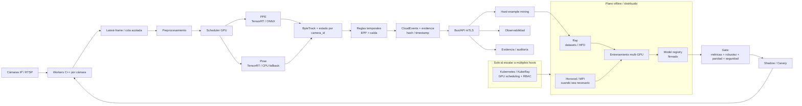
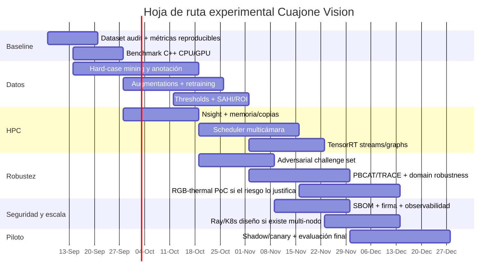

# Investigación profunda: optimización HPC, robustez y mejora de detección para CAMARAS-IP-CUAJONE

**Fecha de corte:** 31 de agosto de 2026  
**Ámbito:** visión por computadora para detección de EPP y caídas mediante cámaras IP, YOLO/C++, cómputo CPU/GPU, procesamiento paralelo y distribuido, escalabilidad, seguridad y robustez adversarial.  
**Repositorio analizado:** `jeanpaulandradeleiva-crypto/CAMARAS-IP-CUAJONE`

**[Descargar el informe completo en Markdown](sandbox:/mnt/data/investigacion_vision_hpc_robustez_cuajone.md)**

## Resumen ejecutivo

El análisis del repositorio cambia de manera importante la recomendación arquitectónica: **CAMARAS-IP-CUAJONE ya no es un prototipo simple Python+YOLO que necesite ser “migrado a C++”**. El proyecto dispone de un runtime nativo C++ para Windows x64, backends ONNX Runtime y TensorRT, soporte CPU/CUDA, ByteTrack, analítica temporal de EPP y caídas, contratos JSON versionados, manifests de modelos, evidencia con hashes, telemetría, pruebas CPU/GPU y un launcher de producción separado del entorno Python de QA. La ruta de producción documentada es MSI → NexoAI Vision launcher → `NexoAIVision.exe`; Python/PyTorch/Ultralytics quedan fuera del runtime productivo. fileciteturn3file0L2-L2 fileciteturn4file0L2-L2

Por ello, la estrategia de mayor retorno **no es reescribir el proyecto ni introducir Kubernetes, Ray o MPI en la ruta crítica inmediatamente**. Conviene fortalecer cuatro frentes, en este orden:

1. **Calidad y reproducibilidad de datos/modelos:** dataset Cuajone estratificado, hard-negative mining, particiones por cámara/video y challenge sets de noche, oclusión, objetos pequeños, camuflaje y ataques físicos.
2. **Profiling y optimización del runtime nativo:** eliminar sincronizaciones/copias innecesarias, preasignar memoria, evaluar pinned memory, ejecución asíncrona y paralelismo entre cámaras.
3. **Robustez del detector:** entrenamiento con datos reales difíciles, domain adaptation, adversarial training/fine-tuning, estrategias para small objects y calibración de los puntos de operación.
4. **Escala distribuida:** recién cuando la carga requiera múltiples GPU/hosts, incorporar un plano de control Kubernetes y usar Ray/Horovod/MPI en las funciones para las que realmente fueron diseñados. La documentación CUDA recomienda precisamente un ciclo de medición, optimización de transferencias y aprovechamiento de ejecución asíncrona antes de asumir beneficios por concurrencia. citeturn22search0turn22search10

El cuello de botella arquitectónico más evidente está explícitamente documentado por el propio proyecto: **los modelos PPE y pose se ejecutan actualmente en secuencia; PPE termina y sincroniza antes de iniciar pose, sin colas GPU ni ejecución concurrente por frame**. Además, esto no es simplemente deuda técnica: con ONNX Runtime CUDA 1.25, el grafo pose presenta una falla en la GTX 1650 Ti del entorno, mientras PPE sí se ejecuta en CUDA; por ello el modo híbrido PPE-CUDA/pose-CPU es deliberado. La optimización correcta es experimentar primero en TensorRT —donde ambos modelos pueden residir en GPU— y conservar el fallback actual hasta demostrar estabilidad y paridad. fileciteturn3file0L2-L2

Desde el punto de vista de precisión del sistema, la literatura reciente apunta a que **los datos del dominio y los hard cases tienen prioridad sobre el preprocesamiento cosmético**. Un estudio de WACV 2024 sobre detección bajo clima adverso encontró que entrenar con imágenes reales all-weather funcionó mejor que sus alternativas sintéticas y que aplicar denoising antes del detector fue la estrategia menos efectiva de las evaluadas. Esto es particularmente importante para Cuajone: CLAHE, gamma correction, Retinex o una red de low-light enhancement deben considerarse hipótesis experimentales, no mejoras garantizadas. citeturn21search10

Para EPP pequeños o distantes, **SAHI** es una de las técnicas con evidencia más directamente aplicable: su trabajo de ICIP 2022 reportó mejoras de AP de 5.1–6.8 puntos usando slicing solamente en inferencia sobre sus benchmarks, y mejoras acumuladas mayores cuando también se realizó fine-tuning con slicing. El costo es computacional, por lo que para Cuajone encaja mejor como una ruta selectiva en cámaras lejanas o como “segunda mirada” sobre regiones dudosas, no necesariamente sobre todos los frames. citeturn15search0

Respecto al ejemplo de prendas diseñadas para dificultar la detección, la amenaza tiene soporte científico mucho más sólido que una noticia aislada. *Adversarial T-shirt*, AdvCaT y trabajos posteriores demuestran que texturas físicas sobre ropa pueden reducir la capacidad de detectores de personas bajo cambios de postura, distancia y vista. Más recientemente, **PBCAT** propone adversarial training contra patches y texturas físicamente realizables, mientras **TRACE** estudia fine-tuning adversarial sobre YOLOv5/YOLOv8 con ataques no vistos y ensayos físicos. citeturn5search1turn20search6turn20search0turn20search10

También hay que evitar una falsa sensación de seguridad por sensor fusion. RGB+thermal tiene fundamento sólido para noche y visibilidad degradada: LLVIP contiene 15,488 pares visible/infrarrojo alineados y Camo-M3FD 2026 estudia específicamente peatones camuflados en datos cross-spectral. Sin embargo, ICCV 2023 demostró un patch físico diseñado para engañar simultáneamente detectores visible e infrarrojo. **La fusión multimodal es redundancia útil, no inmunidad adversarial.** citeturn21academia36turn21search0turn20search3

La conclusión estratégica es:

> **Datos y evaluación → profiling → optimización local → robustez → multicámara → distribución.**

Invertir ese orden suele trasladar problemas de precisión o latencia a una infraestructura más compleja sin resolverlos.

## Diagnóstico del proyecto Cuajone y prioridades de reestructuración

El árbol actual del repositorio ya presenta una separación razonablemente madura. Existen módulos C++ para `capture`, `preprocess`, `yolo_decode`, `onnx_session`, `tensorrt_runtime`, `engine_pipeline`, `byte_tracker`, `ppe_analytics`, `fall_analytics`, `evidence`, `performance_telemetry`, manifests y contratos; además hay pruebas específicas de ONNX CUDA y TensorRT, herramientas de benchmark/exportación/evaluación y un paquete Python de QA separado del producto. fileciteturn2file0L2-L2

El runtime implementa asimismo decisiones que conviene **preservar** durante cualquier optimización: `LatestFrameCapture` evita una cola de video creciente y conserva el frame más reciente cuando el consumidor se atrasa; el pipeline offline sí mantiene orden estricto; los streams RTSP se reconectan; las credenciales del launcher se mantienen en Windows Credential Manager; los logs redactan userinfo; los manifests verifican rol/tipo/tamaño/SHA-256/procedencia de modelos; y existen gates de paridad entre QA y runtime. fileciteturn3file0L2-L2 fileciteturn4file0L2-L2

La siguiente tabla resume dónde concentraría el esfuerzo:

| Prioridad | Intervención | Resultado buscado | Motivo |
|---|---|---|---|
| **P0** | Baseline reproducible de calidad + rendimiento | Saber exactamente dónde se pierden recall, mAP y milisegundos | Optimizar sin baseline impide atribuir mejoras. |
| **P0** | Dataset Cuajone por cámaras/turnos/hard cases | Mejor generalización real | La literatura bajo clima adverso favorece entrenamiento representativo sobre “arreglar” la imagen a posteriori. citeturn21search10turn21search1 |
| **P0** | Nsight + TensorRT profiling | Identificar sincronizaciones, copias y esperas CPU/GPU | CUDA recomienda medir transferencias, sincronización y concurrencia en streams explícitamente. citeturn22search0turn22search10 |
| **P0** | Calibración de thresholds por clase | Mejor punto Precision/Recall/F1 | Cambia el punto operativo sin necesidad de cambiar el detector; debe hacerse exclusivamente en validación. |
| **P1** | Scheduler multicámara con colas acotadas | Mayor throughput con latencia controlada | Se adapta al modelo `latest frame` que el proyecto ya usa. fileciteturn3file0L2-L2 |
| **P1** | Paralelismo TensorRT PPE/pose o entre cámaras | Utilización GPU superior | Hoy PPE y pose están serializados; es la oportunidad de paralelismo más explícita. fileciteturn3file0L2-L2 |
| **P1** | SAHI/ROI high-resolution selectivo | Recuperar EPP pequeños/lejanos | SAHI tiene evidencia específica para small-object detection. citeturn15search0 |
| **P1** | Challenge set adversarial + PBCAT/TRACE | Robustez ante patrones físicos | Existe evidencia de ataques realizables físicamente y defensas basadas en training. citeturn20search0turn20search10 |
| **P2** | RGB+thermal | Noche, camuflaje y pérdida de contraste | LLVIP/Camo-M3FD respaldan la complementariedad espectral. citeturn21academia36turn21search0 |
| **P2** | Ray/Horovod/MPI/Kubernetes | Escala multi-GPU/multi-host | Son herramientas valiosas, pero resuelven problemas diferentes del hot path de una cámara. citeturn2search2turn2search7turn22search4 |

**Un aspecto especialmente favorable del repositorio es que ya existe una frontera Python/C++.** El documento de coupling define Python como entorno de experimentación/QA, mientras el núcleo de producción permanece nativo y la promoción exige contratos, paridad y evidencia. Eso permite usar Python, Ray, herramientas de training y notebooks agresivamente en I+D sin introducirlos dentro del binario productivo. fileciteturn4file0L2-L2

También conviene mantener la política actual de no declarar una equivalencia completa solamente por una prueba sintética. En visión industrial, la paridad real debe cubrir **preprocesamiento, decoding, detecciones, keypoints, tracking, reglas temporales y eventos** sobre artefactos y videos autorizados. El proyecto ya ha construido esa idea en su gate de seis etapas; la propuesta de investigación debería ampliar ese gate con calidad estadística y hard cases, no reemplazarlo. fileciteturn4file0L2-L2

## Literatura priorizada y recursos

La priorización siguiente combina tres criterios: aplicabilidad inmediata a Cuajone, solidez de la fuente y actualidad. Los artículos recientes de los últimos ocho años tienen preferencia, manteniendo algunos clásicos cuya técnica sigue siendo central.

**Libros recomendados**

| Prioridad | Libro | Por qué leerlo |
|---|---|---|
| **P0** | **Hwu, Kirk, El Hajj — *Programming Massively Parallel Processors: A Hands-on Approach*, 4.ª ed. (2022).** [Elsevier/ScienceDirect](https://www.sciencedirect.com/book/9780323912310/programming-massively-parallel-processors) | Es probablemente el libro más directamente útil para el runtime nativo: jerarquía de memoria GPU, localidad, CUDA, patrones paralelos, streams y cómputo heterogéneo. Da la base necesaria para decidir dónde el paralelismo GPU realmente ayuda y dónde solo aumenta sincronización. citeturn13search0 |
| **P0** | **Sterling, Brodowicz, Anderson — *High Performance Computing: Modern Systems and Practices*, 2.ª ed. (2024).** [Elsevier](https://www.sciencedirect.com/book/9780443133645/high-performance-computing) | Marco integral de arquitectura HPC, paralelismo, aceleradores, performance debugging y sistemas modernos. Es la referencia apropiada para pensar la evolución de Cuajone desde un nodo edge hacia una topología multi-GPU o distribuida. citeturn1search0 |
| **P0** | **Andrist, Sehr, Garney — *C++ High Performance*, 2.ª ed. (2020).** [Packt](https://www.packtpub.com/) | Orientado a rendimiento real en C++ moderno: layouts de datos, memoria, concurrencia, profiling y reducción de overhead. Es más directamente accionable sobre `native/src/*` que un texto genérico de IA. citeturn1search1 |
| **P1** | **Deakin, Mattson — *Programming Your GPU with OpenMP* (2023).** [MIT Press](https://mitpress.mit.edu/9780262547536/programming-your-gpu-with-openmp/) | Ofrece una visión portable de offload CPU/GPU. TensorRT/CUDA seguirá siendo la ruta natural para inferencia, pero OpenMP resulta relevante para kernels auxiliares, algoritmos CPU y portabilidad. citeturn1search15 |
| **P1** | **van der Pas, Stotzer, Terboven — *Using OpenMP—The Next Step* (2017).** [MIT Press](https://mitpress.mit.edu/9780262534789/using-openmp-the-next-step/) | Clásico avanzado sobre tasking, SIMD y afinidad. Aunque anterior al horizonte de ocho años, sigue siendo valioso para paralelizar pre/postprocesamiento y cargas CPU. citeturn1search7 |

**Artículos científicos de mayor prioridad**

| Prioridad | Artículo | Relevancia para EPP/caídas |
|---|---|---|
| **P0** | **PBCAT: Patch-Based Composite Adversarial Training against Physically Realizable Attacks on Object Detection — ICCV 2025.** [CVF](https://openaccess.thecvf.com/content/ICCV2025/html/Li_PBCAT_Patch-Based_Composite_Adversarial_Training_against_Physically_Realizable_Attacks_on_ICCV_2025_paper.html) | Adversarial training unificado contra patches y perturbaciones que busca generalizar también a texturas físicas no vistas. En sus experimentos, reporta una mejora de 29.7% de accuracy de detección frente a defensas previas bajo uno de los ataques de textura considerados. Es el candidato científico más directo para la fase de robustez. citeturn20search0 |
| **P0** | **TRACE: Confounder-free Adversarial Fine-tuning for Robust Object Detection — WACV 2026.** [CVF](https://openaccess.thecvf.com/content/WACV2026/html/Lee_TRACE_Confounder-free_Adversarial_Fine-tuning_for_Robust_Object_Detection_WACV_2026_paper.html) | Fine-tuning orientado a evitar sobreajuste a un patch específico, tratando ubicación, rotación y brillo como confusores. Fue probado en YOLOv5/YOLOv8, ataques no vistos y un testbed físico, por lo que es especialmente relevante al stack YOLO. citeturn20search10 |
| **P0** | **Physically Realizable Natural-Looking Clothing Textures Evade Person Detectors via 3D Modeling — CVPR 2023.** [CVF](https://openaccess.thecvf.com/content/CVPR2023/html/Hu_Physically_Realizable_Natural-Looking_Clothing_Textures_Evade_Person_Detectors_via_3D_CVPR_2023_paper.html) | AdvCaT muestra que una amenaza física puede adoptar apariencia de textura/camuflaje normal y mantener efectividad entre diferentes ángulos. Para Cuajone implica que un challenge set no debe limitarse a patches cuadrados obvios. citeturn20search6 |
| **P0** | **Unified Adversarial Patch for Cross-Modal Attacks in the Physical World — ICCV 2023.** [CVF](https://openaccess.thecvf.com/content/ICCV2023/html/Wei_Unified_Adversarial_Patch_for_Cross-Modal_Attacks_in_the_Physical_World_ICCV_2023_paper.html) | Demuestra un único artefacto capaz de atacar detectores visible e infrarrojo y valida el ataque bajo distintos ángulos, distancias, posturas y escenarios físicos. Es una advertencia fundamental contra considerar RGB+thermal una defensa suficiente por sí sola. citeturn20search3 |
| **P0** | **LLVIP: A Visible-Infrared Paired Dataset for Low-light Vision — 2021.** [arXiv](https://arxiv.org/abs/2108.10831) | Contiene 30,976 imágenes, es decir 15,488 pares visible/infrarrojo alineados, predominantemente en escenas muy oscuras, con peatones etiquetados. Es uno de los mejores bancos públicos para una PoC de baja iluminación. citeturn21academia36 |
| **P0** | **Camo-M3FD: A New Benchmark Dataset for Cross-Spectral Camouflaged Pedestrian Detection — CVPR Workshops 2026.** [CVF](https://openaccess.thecvf.com/content/CVPR2026W/SVC/html/Velesaca_Camo-M3FD_A_New_Benchmark_Dataset_for_Cross-Spectral_Camouflaged_Pedestrian_Detection_CVPRW_2026_paper.html) | Benchmark visible-termal específicamente construido alrededor de peatones camuflados; sus resultados muestran que la señal térmica aporta localización crítica y la fusión mejora la recuperación estructural. Es muy cercano al problema de vigilancia de seguridad planteado. citeturn21search0 |
| **P0** | **Slicing Aided Hyper Inference and Fine-Tuning for Small Object Detection — ICIP 2022.** [DOI](https://doi.org/10.1109/ICIP46576.2022.9897990) | SAHI divide imágenes de alta resolución en regiones para aumentar el tamaño aparente de objetos pequeños. Los autores reportan incrementos importantes de AP en VisDrone/xView; en Cuajone debe probarse para cascos, lentes, guantes u otros EPP alejados. citeturn15search0 |
| **P0** | **YOLOv10: Real-Time End-to-End Object Detection — 2024.** [arXiv](https://arxiv.org/abs/2405.14458) | Referencia moderna sobre el compromiso accuracy/latency y eliminación de NMS mediante consistent dual assignments. Conviene usarlo como benchmark arquitectónico, no asumir que cambiar al detector más reciente superará al modelo Cuajone fine-tuned. citeturn0search0 |
| **P1** | **Adversarial T-shirt! Evading Person Detectors in a Physical World — 2019/ECCV 2020.** [arXiv](https://arxiv.org/abs/1910.11099) | Referencia clásica para prendas adversariales no rígidas. Los autores reportaron ataques tanto digitales como físicos contra detectores de personas, demostrando que la deformación de tela no elimina necesariamente el efecto adversarial. citeturn5search1 |
| **P1** | **Jedi: Entropy-Based Localization and Removal of Adversarial Patches — CVPR 2023.** [CVF](https://openaccess.thecvf.com/content/CVPR2023/html/Tarchoun_Jedi_Entropy-Based_Localization_and_Removal_of_Adversarial_Patches_CVPR_2023_paper.html) | Defensa model-agnostic basada en entropía y reconstrucción; sus benchmarks reportan en promedio 90% de detección de patches y recuperación de hasta 94% de ataques exitosos. Es una posible segunda capa, no sustituto del adversarial training. citeturn20search1 |
| **P1** | **Beyond Fusion: Modality Hallucination-Based Multispectral Fusion for Pedestrian Detection — WACV 2024.** [CVF](https://openaccess.thecvf.com/content/WACV2024/html/Xie_Beyond_Fusion_Modality_Hallucination-Based_Multispectral_Fusion_for_Pedestrian_Detection_WACV_2024_paper.html) | Introduce una rama que aprende a compensar la degradación del canal visible antes de fusionar información térmica/visible. Es una referencia útil si el proyecto evoluciona a cámaras multispectrales. citeturn21search6 |
| **P1** | **Auxiliary Domain-guided Adaptive Detection in Adverse Weather Conditions — ACCV 2024.** [CVF](https://openaccess.thecvf.com/content/ACCV2024/html/Fu_Auxiliary_Domain-guided_Adaptive_Detection_in_Adverse_Weather_Conditions_ACCV_2024_paper.html) | Trabaja domain adaptation para detectores one-stage bajo clima adverso, combinando un dominio auxiliar y contrastive learning. Es transferible conceptualmente a cambios de iluminación, polvo, neblina y cámaras. citeturn21search1 |
| **P1** | **Robust Object Detection in Challenging Weather Conditions — WACV 2024.** [CVF](https://openaccess.thecvf.com/content/WACV2024/html/Gupta_Robust_Object_Detection_in_Challenging_Weather_Conditions_WACV_2024_paper.html) | Compara datos reales, clima sintético y denoising. El resultado especialmente útil para Cuajone es que el entrenamiento sobre datos reales all-weather fue el mejor de sus enfoques, mientras el denoising previo fue el peor. citeturn21search10 |
| **P1** | **Simple Copy-Paste Is a Strong Data Augmentation Method — CVPR 2021.** [CVF](https://openaccess.thecvf.com/content/CVPR2021/html/Ghiasi_Simple_Copy-Paste_Is_a_Strong_Data_Augmentation_Method_for_Instance_CVPR_2021_paper.html) | Sustenta el uso de Copy-Paste como augmentation. En EPP debe imponerse semántica anatómica: un casco debe copiarse sobre una cabeza plausible, no simplemente a coordenadas aleatorias. citeturn9search0 |
| **P1** | **Distance-IoU Loss: Faster and Better Learning for Bounding Box Regression — AAAI 2020.** [AAAI](https://ojs.aaai.org/index.php/AAAI/article/view/6999) | DIoU/CIoU incorporan distancia entre centros y geometría adicional frente a IoU/GIoU. Es una referencia apropiada para experimentar con errores de localización y convergencia. citeturn16search0 |
| **P1** | **Weighted Boxes Fusion — 2019.** [arXiv](https://arxiv.org/abs/1910.13302) | WBF combina las coordenadas y confidencias de varios predictores en lugar de descartar cajas. Es especialmente útil para ensembles y TTA, aunque implica mayor latencia. citeturn10search1 |
| **P1** | **Ray: A Distributed Framework for Emerging AI Applications — OSDI 2018.** [USENIX](https://www.usenix.org/conference/osdi18/presentation/moritz) | Su modelo de tasks/actors está pensado para aplicaciones de IA dinámicas y distribuidas. En esta solución encaja en experimentación, HPO y procesamiento de datos, no dentro del ejecutable C++ de la cámara. citeturn2search7 |
| **P1** | **Horovod: fast and easy distributed deep learning — 2018.** [arXiv](https://arxiv.org/abs/1802.05799) | Introduce una estrategia práctica de entrenamiento distribuido basada en allreduce. Tiene sentido cuando el entrenamiento ya justifique múltiples GPU/nodos, no como orquestador de streams RTSP. citeturn2search2 |
| **P1** | **UP-Fall Detection Dataset: A Multimodal Approach — Sensors 2019.** [DOI](https://doi.org/10.3390/s19091988) | Dataset de caídas y actividades cotidianas con múltiples sensores y dos cámaras. Es útil para evaluar conceptos temporales, aunque sus caídas simuladas no representan por sí solas las condiciones industriales reales de Cuajone. citeturn18search0 |
| **Clásico** | **Focal Loss for Dense Object Detection — ICCV 2017.** [CVF](https://openaccess.thecvf.com/content_iccv_2017/html/Lin_Focal_Loss_for_ICCV_2017_paper.html) | Suprime la contribución de ejemplos fáciles y concentra entrenamiento en ejemplos difíciles, por lo que sigue siendo una referencia central cuando existe fuerte desbalance de clases/background. citeturn9search1 |
| **Clásico** | **Soft-NMS — Improving Object Detection With One Line of Code — ICCV 2017.** [CVF](https://openaccess.thecvf.com/content_iccv_2017/html/Bodla_Soft-NMS_--_Improving_ICCV_2017_paper.html) | Reduce gradualmente scores de cajas solapadas en vez de eliminarlas abruptamente. Los autores reportaron mejoras de AP en sus detectores sin reentrenamiento; para YOLO/Cuajone debe evaluarse frente al postprocesamiento actual. citeturn16search1 |

A estas publicaciones sumaría tres referencias normativas de seguridad: **NIST AI RMF 1.0** para gestión de riesgo de IA; **NIST AI 100-2e2025** para taxonomía de adversarial machine learning, incluyendo evasión y poisoning; y **NIST SP 800-218 SSDF** para incorporar seguridad dentro del ciclo de desarrollo de software. citeturn19search5turn19search0turn19search12

## Optimización HPC, paralelización, distribución y seguridad

La optimización debe distinguir **latencia**, **throughput**, **uso de memoria** y **accuracy**. Optimizar solamente FPS puede ser contraproducente para una aplicación de seguridad si incrementa p99, descarta demasiados frames críticos o degrada recall de casco/caída.

**Profiling por etapas.** Recomiendo extender la telemetría que ya existe para registrar, como mínimo:

`RTSP/decode → resize/letterbox → H2D → PPE → pose → D2H → YOLO decode/NMS → ByteTrack → reglas EPP/caída → anotación/evidencia → serialización`.

Nsight Systems es apropiado para descubrir huecos entre CPU y GPU, sincronizaciones, transferencias y concurrencia; TensorRT ofrece además herramientas y recomendaciones para performance profiling. CUDA recuerda que las operaciones asíncronas y streams pueden solapar copia y cómputo, pero solo si hardware, dependencias y memoria lo permiten. citeturn22search0turn22search10

**Memoria.** La guía CUDA recomienda mantener estructuras intermedias en GPU cuando sea posible, agrupar transferencias pequeñas y usar memoria page-locked/pinned cuando realmente se aprovechen transferencias asíncronas; también advierte que pinned memory es un recurso que no debe sobreutilizarse. En Cuajone esto se traduce en preasignar buffers por worker/contexto, eliminar `malloc/new/cudaMalloc` del loop por frame y medir cuántas copias introduce cada backend. citeturn22search0

**Concurrencia.** La recomendación más interesante es probar un pipeline doble:

- mientras el frame `N` ejecuta inferencia, la CPU prepara `N+1`;
- mientras una cámara está en postprocesamiento, otra puede ocupar GPU;
- en TensorRT, PPE y pose pueden estudiarse con contextos/streams distintos si no existe dependencia directa;
- la analítica temporal posterior se reordena por `camera_id` y timestamp.

CUDA permite solapar trabajo en streams no predeterminados en dispositivos compatibles, y TensorRT dispone de mecanismos para multistreaming y CUDA Graph capture; sin embargo, actividades síncronas o el legacy default stream pueden reintroducir serialización. citeturn22search0turn22search10

La condición crítica es **no asumir aceleración lineal**. Si PPE ya ocupa todos los SM o si los dos engines exceden la memoria disponible, la ejecución simultánea puede ser peor. Esto es especialmente sensible en el hardware actual, ya que el README menciona explícitamente una GTX 1650 Ti de 4 GiB y la necesidad de verificar el consumo residente de ambos engines. fileciteturn3file0L2-L2

**CPU.** No todo debe migrarse a CUDA. ByteTrack, reglas temporales, eventos y cierto postprocesamiento son suficientemente pequeños como para que el costo de transferencia sea mayor que su cómputo. OpenMP continúa siendo un estándar vigente para paralelismo de memoria compartida y offload; MPI, por el contrario, está orientado a procesos sobre arquitecturas de memoria distribuida y clusters. MPI 5.0 fue aprobado por el MPI Forum el 5 de junio de 2025. citeturn2search1turn22search14turn22search4

**Micro-batching.** En una instalación con muchas cámaras, agrupar frames de cámaras independientes puede aumentar utilización GPU. La condición es mantener un límite de espera muy pequeño: un sistema de seguridad no debe acumular frames durante decenas o cientos de milisegundos solo para maximizar throughput. Plataformas de serving como Triton soportan dynamic batching precisamente para explotar este compromiso entre throughput y queue delay. citeturn11search2

Para Cuajone, el batching debería limitarse a la **porción stateless de inferencia**. ByteTrack, historial de EPP y detección temporal de caídas deben seguir separados y ordenados por cámara.

**Precision reducida.** La secuencia experimental sería:

`FP32 baseline → FP16 TensorRT → INT8 solo con calibration/evaluation`.

FP16 es normalmente el candidato inicial porque TensorRT está diseñado para explotar precision reducida, pero cualquier cambio debe validarse contra el conjunto Cuajone, por clase y hard case. INT8 puede reducir memoria y acelerar inferencia, pero una regresión de recall en casco o persona vuelve irrelevante la ganancia de FPS. citeturn0search4turn22search10

**Rol real de los frameworks distribuidos.**

| Tecnología | Uso recomendado en este proyecto | No utilizarla principalmente para |
|---|---|---|
| **OpenMP/TBB/thread pool C++** | Paralelismo local de CPU, decode/preprocesamiento, tareas independientes | Coordinar servidores remotos |
| **CUDA/TensorRT** | Inferencia GPU y pipeline asíncrono | Estado distribuido de cámaras |
| **MPI** | Jobs HPC, preprocesamiento científico o entrenamiento estrechamente acoplado | Serving RTSP continuo |
| **Horovod** | Entrenamiento data-parallel multi-GPU/multi-nodo | Inferencia edge por cámara |
| **Ray** | HPO, experimentos, ETL de datasets, actores distribuidos | Sustituir el runtime C++ productivo |
| **Kubernetes/KubeRay** | Operar múltiples servidores GPU, rollout, aislamiento, health checks | Añadir complejidad a un único Windows edge host |
| **Triton, opcional** | Serving central stateless y batching de modelos | Tracking/estado temporal sin diseño adicional |

Ray fue concebido alrededor de un modelo distribuido de tasks y actors para aplicaciones emergentes de IA; Horovod se centra en entrenamiento distribuido/allreduce; MPI está orientado a sistemas de memoria distribuida de propósito general. Por eso no son intercambiables. citeturn2search7turn2search2turn22search4

**Arquitectura distribuida propuesta**

Este diseño preserva una distinción clave: **data plane cerca de las cámaras y control/training plane central**. La inferencia edge evita enviar video completo a un servidor por necesidad, reduce dependencia de red y preserva la semántica temporal del runtime; el plano central recibe eventos, evidencia seleccionada, métricas y muestras autorizadas.

**Seguridad.** El repositorio ya aplica controles poco comunes en un prototipo: Credential Manager para RTSP, redacción de userinfo, manifests y hashes, validación de artefactos, cierre explícito de DLLs y release gates. fileciteturn3file0L2-L2

La siguiente capa debería incluir firma criptográfica de modelos/releases además de hashes, SBOM, escaneo de dependencias, rotación de secretos, mTLS, RBAC, segmentación de red, control de procedencia de datasets y auditoría de promociones. NIST recomienda integrar prácticas de desarrollo seguro en el SDLC y gestionar explícitamente riesgos propios de ML, entre ellos evasión y poisoning. citeturn19search0turn19search12

En Kubernetes, las capacidades oficiales relevantes incluyen device plugins para GPU, Pod Security Standards y NetworkPolicy; deben utilizarse junto con mínimo privilegio y un gestor de secretos, no asumir que la contenerización por sí sola proporciona aislamiento suficiente. citeturn3search2turn3search1turn3search5

## Robustez frente a camuflaje, adversarios, oclusión, noche y vistas extremas

**Camuflaje y prendas adversariales.** Este debe convertirse en un threat model explícito. *Adversarial T-shirt* mostró ataques físicos contra person detectors y los trabajos posteriores han mejorado naturalidad, transferencia entre detectores, robustez multi-vista y realizabilidad física. AdvCaT utiliza modelado 3D y deformaciones de tela para producir texturas de ropa más naturales; ACTIVE mostró transferibilidad física de camuflaje en múltiples detectores; trabajos 2025 continúan desarrollando técnicas más difíciles de distinguir. citeturn5search1turn20search6turn20search2turn20search14

La consecuencia práctica es que **no basta entrenar contra un patrón adversarial conocido**. El challenge set debería contener familias:

- patches visibles y naturalistas;
- texturas repartidas sobre camiseta/chaleco;
- diferentes escalas, distancias y rotaciones;
- deformaciones por caminar/agacharse;
- cambio de luz;
- movimiento y blur;
- compresión de videovigilancia;
- ataques generados contra un modelo distinto del desplegado para medir transferibilidad.

BadPatch/AdvT-shirt-1K aporta además más de mil imágenes físicas de camisetas adversariales en escenarios variados, por lo que es un recurso interesante para una prueba externa antes de construir el benchmark propio. citeturn20search4

**Defensa adversarial.** Mi prioridad experimental sería:

`baseline → PBCAT → TRACE → PBCAT/TRACE + detector secundario tipo Jedi → hard-case físico`.

PBCAT es atractivo porque intenta cubrir tanto patches como texturas físicas no vistas; TRACE porque ataca el problema de generalización a ubicación, rotación y brillo y ya fue estudiado con YOLO. Jedi puede servir como alarma secundaria de “región sospechosa”, pero la propia evolución de ataques invisibles/naturalistas muestra que ninguna técnica de patch detection debería asumirse universal. citeturn20search0turn20search10turn20search1turn20search12

En otras palabras, la política correcta es **defensa en profundidad**, no “detectar el patch y problema resuelto”.

**Oclusión.** En escenas con personas parcialmente tapadas, hay tres defensas complementarias: datos de entrenamiento con oclusiones reales, seguimiento temporal y, donde exista solapamiento físico entre cámaras, fusión multi-vista. El proyecto ya dispone de ByteTrack y votación/analítica temporal, por lo que tiene una ventaja frente a una inferencia frame-by-frame pura. fileciteturn3file0L2-L2

Para evaluación, no reportaría solo mAP global. Añadiría bins como:

`visibilidad >75%`, `50–75%`, `25–50%`, `<25%`

y mediría especialmente recall de persona y recall de cada EPP dentro de esos grupos. Esto permite distinguir “el detector no vio a la persona” de “vio a la persona pero no logró asociar correctamente el casco/chaleco”.

**Baja iluminación.** LLVIP demuestra la utilidad de información visible e infrarroja complementaria en escenarios oscuros y *Beyond Fusion* estudia precisamente el problema de que la rama RGB degradada puede introducir ruido en una fusión ingenua. citeturn21academia36turn21search6

Para el sistema RGB existente, la primera línea no debería ser una nueva red de enhancement. Conviene capturar y etiquetar noche, amanecer, contraluz, sombras, faros, iluminación artificial y polvo, y después augmentar con transformaciones fotométricas cuya distribución se parezca a esos datos. El resultado de WACV 2024 de que el entrenamiento con datos reales adversos superó al denoising previo respalda esta prioridad. citeturn21search10

**Domain adaptation.** Cuando una cámara nueva tenga un dominio visual distinto —altura, lente, fondo, iluminación, compresión—, puede ser más eficiente adaptar el detector que volver a entrenarlo desde cero. ACCV 2024 muestra un método de adaptación one-stage bajo clima adverso usando dominio auxiliar y contraste; otros trabajos recientes estudian adaptación de video bajo degradaciones. citeturn21search1turn21search9

Para Cuajone, una adaptación prudente sería **offline y aprobada**, no online automática. El flujo actual de promoción con procedencia/paridad ya favorece ese modelo de gobernanza. fileciteturn4file0L2-L2

**Ángulos extremos y lentes.** El entrenamiento debe incorporar transformaciones de perspectiva y escala físicamente plausibles, pero la evidencia real por cámara es insustituible. En cámaras fisheye o gran angular, conviene evaluar entrenamiento explícito con esa distorsión, rectificación selectiva o un modelo adaptado al dominio. No es recomendable “corregir” toda imagen por defecto sin medir el efecto sobre detector y latencia.

**Objetos pequeños.** Éste probablemente sea uno de los problemas de mayor impacto para EPP. Un casco o lentes a decenas de metros puede tener muy pocos píxeles incluso si la persona todavía es detectable. Debe medirse AP/Recall por tamaño y comparar las resoluciones que el launcher ya permite —640/768/960/1280— antes de adoptar una resolución única. fileciteturn3file0L2-L2

SAHI es una opción potente, pero propongo un diseño **selectivo**:

`detector normal → detectar persona/ROI distante → ampliar ROI o slicing → detector EPP de segunda pasada`.

Eso concentra el costo en personas donde realmente existe riesgo de perder EPP pequeño, en lugar de multiplicar todo el frame siempre. La literatura de SAHI respalda específicamente el slicing para small-object detection. citeturn15search0

**Caídas.** El enfoque actual de pose + geometría + tracking + confirmación temporal es conceptualmente más apropiado para un evento temporal que una clasificación aislada de un frame. El repositorio ya valida keypoints y usa criterios de descenso, confirmación, recuperación y cooldown. fileciteturn3file0L2-L2

El dataset de hard negatives de caídas debe priorizar actividades que visualmente se confunden con el evento:

arrodillarse, agacharse, sentarse, acostarse deliberadamente, trabajar debajo de equipos, gatear, recoger objetos, resbalar sin caer, subir/bajar desniveles y asistir a otra persona. UP-Fall puede complementar experimentos, pero al basarse en caídas simuladas no debe sustituir un benchmark industrial del sitio. citeturn18search0

**Sensor fusion.** RGB+thermal sería mi primera opción multimodal si el análisis de riesgo justifica nuevo hardware. Camo-M3FD 2026 está particularmente alineado porque estudia peatones camuflados cross-spectral y concluye que thermal aporta localización mientras la fusión ayuda a recuperar estructura. citeturn21search0

Pero el ataque cross-modal de ICCV 2023 consiguió Attack Success Rates reportados de 73.33% y 69.17% contra YOLOv3 y Faster R-CNN respectivamente, atacando simultáneamente visible e infrarrojo, y fue validado físicamente bajo diferentes configuraciones. Por tanto, la fusión disminuye ciertos failure modes naturales, pero sigue requiriendo adversarial testing. citeturn20search3

## Mejora de métricas y protocolo reproducible

Las métricas básicas deben distinguirse claramente:

\[
Precision=\frac{TP}{TP+FP}
\]

\[
Recall=\frac{TP}{TP+FN}
\]

\[
F1=2\frac{Precision\cdot Recall}{Precision+Recall}
\]

Para detección recomiendo reportar al menos `AP50`, `AP75` y `mAP50-95`, además de métricas por clase y tamaño. El protocolo COCO popularizó precisamente la evaluación sobre múltiples IoU y categorías, evitando reducir calidad del detector a un único threshold fácil. citeturn17search0turn17search2

Hay una distinción muy importante para el proyecto:

> **optimizar el confidence threshold puede mejorar F1 o mover el compromiso Precision/Recall, pero no equivale a mejorar el detector.**

El threshold debe seleccionarse sobre `validation` y congelarse antes de abrir `test`. Elegirlo sobre test introduce optimismo. Para clases de costo desigual —por ejemplo, no detectar casco vs. generar una falsa alarma— tiene sentido usar thresholds específicos por clase.

**Cómo subir Precision.** Las palancas principales son mejorar hard negatives, etiquetas ambiguas, postprocesamiento y calibración. Soft-NMS puede ayudar cuando cajas correctas compiten en zonas densas, mientras un segundo clasificador/verificador puede filtrar alarmas dudosas. Soft-NMS reportó incrementos de mAP en los detectores evaluados por sus autores sin modificar el training, pero ese resultado no debe extrapolarse automáticamente al decoder YOLO de Cuajone. citeturn16search1

**Cómo subir Recall.** Para EPP tiende a ser especialmente valioso mejorar resolución efectiva, balancear clases poco frecuentes, incluir ejemplos parciales/ocultos y recuperar small objects con SAHI/ROI crops. Reducir el confidence threshold también sube recall, pero normalmente a costa de precision; por ello no reemplaza las mejoras de training. citeturn15search0

**Cómo mejorar F1.** F1 es especialmente sensible al threshold operativo. Conviene construir las curvas Precision-Recall por clase, seleccionar el punto objetivo en validación y bloquearlo en test. Para seguridad incluso podría elegirse un punto que no maximice F1 si la organización asigna un costo mucho mayor a los falsos negativos.

**Cómo mejorar mAP.** Aquí las intervenciones con mayor fundamento son:

datos mejores → labels más consistentes → objects pequeños → balance de clases → augmentations realistas → pérdida/localización → domain robustness → modelo/arquitectura → ensemble.

Focal Loss es el clásico para concentrar aprendizaje en ejemplos difíciles frente a desbalance; DIoU/CIoU son herramientas de regresión geométrica; Copy-Paste proporciona diversidad de training; SAHI ataca directamente small objects. citeturn9search1turn16search0turn9search0turn15search0

**TTA y ensembles.** Test-time augmentation y múltiples modelos pueden mejorar estabilidad y mAP, pero cada transformación/modelo multiplica costo. Weighted Boxes Fusion aprovecha precisamente las predicciones múltiples. Para un sistema 24/7, considero mejor un esquema de dos velocidades:

`fast path continuo → slow verifier cuando existe alarma/inconsistencia`.

Así, TTA/ensemble/WBF se ejecutan sobre eventos o ROIs de baja confianza, no sobre todos los frames. citeturn10search1

**Tracking y votación temporal.** Mejoran las métricas del **sistema de seguridad**, aunque no necesariamente el mAP frame-level. Por ejemplo, tres detecciones débiles consecutivas de casco pueden ser evidencia operacional más fuerte que un solo frame; de forma inversa, una ausencia de casco en un frame parcialmente ocluido no debe disparar una violación inmediata. El repositorio ya implementa asociación anatómica, votación temporal y cooldown, por lo que las métricas deben cubrir también esta capa. fileciteturn3file0L2-L2

Por eso propongo dos familias de métricas:

| Nivel | Métricas |
|---|---|
| **Detector/frame** | Precision, Recall, F1, AP50, AP75, mAP50-95, AP por clase/tamaño |
| **Tracking** | continuidad de track, fragmentación, pérdida temporal, asociaciones incorrectas |
| **EPP/evento** | event precision/recall/F1, falsas alarmas por cámara-hora, duración de violaciones no detectadas |
| **Caída/evento** | sensibilidad de caída, falsas caídas/hora, tiempo hasta alarma, recuperación/cancelación correcta |
| **Robustez** | clean mAP vs. noche/oclusión/camuflaje/adversarial/weather mAP |
| **Runtime** | FPS/cámara, p50/p95/p99, frames descartados, GPU/CPU/VRAM, reconexiones |
| **Operación** | eventos con evidencia válida, disponibilidad, fallos de cámara, ratio de revisión humana |

**Protocolo reproducible recomendado**

La partición debe realizarse por **cámara, video o bloque temporal**, no aleatoriamente por frames del mismo clip. Frames consecutivos son casi duplicados y compartirlos entre train/test produce una estimación demasiado optimista de generalización.

El manifiesto de cada experimento debe congelar:

`dataset hash + lista de videos + commit + modelo base + seed + CUDA/TensorRT/ORT + GPU + imgsz + augmentation config + loss + thresholds + NMS + engine hash`.

Esto encaja muy bien con los contratos, hashes y recibos de paridad ya presentes en el repositorio. fileciteturn4file0L2-L2

Para experimentos de training sensibles, usaría al menos tres seeds y reportaría media/desviación. Para intervalos de confianza del sistema de video, haría bootstrap a nivel de cámara/video y no frame, porque los frames consecutivos están fuertemente correlacionados.

El test final debería permanecer congelado en dos partes:

**`test-production`**, representativo de operación normal; y  
**`test-challenge`**, deliberadamente difícil: noche, polvo, lluvia/niebla si aplica, contraluz, compresión, motion blur, EPP pequeño, oclusión, perspectiva extrema, ropa camuflada y ataques adversariales.

Una mejora no debería promocionarse simplemente porque aumenta el mAP agregado. Si `mAP +1.0` viene acompañado de `Recall casco nocturno -8` o más falsas caídas, el resultado puede ser operacionalmente peor.

## Recomendaciones prácticas y plan experimental

La prioridad absoluta es construir un **Cuajone Safety Vision Benchmark** interno. Los datasets públicos son útiles para pretraining y stress testing, pero la evidencia decisiva debe proceder de cámaras, lentes, posiciones, compresión, iluminación, fondos y EPP reales del sitio.

Una composición razonable sería:

| Dataset | Uso |
|---|---|
| **Cuajone interno** | Benchmark principal y criterio de promoción |
| **LLVIP** | Noche y experimentos visible/infrarrojo. citeturn21academia36 |
| **Camo-M3FD** | Camuflaje cross-spectral. citeturn21search0 |
| **AdvT-shirt-1K** | Ropa/patch adversarial físico. citeturn20search4 |
| **CrowdHuman** | Oclusión y personas densamente agrupadas. citeturn8search0 |
| **UP-Fall** | Benchmark complementario para dinámica de caídas/ADL. citeturn18search0 |

**Experimentos de datos.** Primero mediría errores del modelo actual y anotaría su taxonomía. Un sample de 1,000 falsos positivos y 1,000 falsos negativos clasificados por causa suele ser más valioso que lanzar inmediatamente otra búsqueda de hiperparámetros. Los buckets serían: `small object`, `occlusion`, `lighting`, `perspective`, `motion blur`, `compression`, `wrong association PPE-person`, `label error`, `look-alike`, `adversarial/camouflage`.

**Hard-negative mining** debe integrarse en el ciclo habitual: cada piloto produce falsos positivos reales; esos clips se revisan y pasan al pool de entrenamiento/validación con trazabilidad.

**Experimentos de resolución.** Aprovecharía las resoluciones ya soportadas por el launcher y compararía 640, 768, 960 y 1280 bajo el mismo checkpoint/configuración. fileciteturn3file0L2-L2 No elegiría 1280 porque “ve más”: mediría `Δrecall-small / Δp95-latency / ΔVRAM`.

**Experimentos SAHI/ROI.** Solo sobre cámaras donde el análisis de error muestre que la mayoría de FN son small objects. SAHI completo puede ser costoso; una versión pragmática es recortar cada persona distante y ejecutar una segunda detección EPP sobre el ROI. citeturn15search0

**Experimentos adversariales.** Generar un set digital con transformaciones físicas y luego una prueba controlada física. Comparar baseline, PBCAT y TRACE con exactamente el mismo clean test. La promoción requiere mejorar robustez sin degradar de forma material el clean mAP/recall. citeturn20search0turn20search10

**Experimentos de rendimiento.** En el runtime actual, la matriz mínima debería ser:

`CPU ONNX`  
`PPE CUDA + pose CPU ONNX`  
`TensorRT FP32`  
`TensorRT FP16`  
`TensorRT FP16 + pipeline multicámara`  
`TensorRT FP16 + streams experimentales`  
`TensorRT INT8` — solo después de tener dataset de calibración.

La prueba debe usar los mismos clips y medir no solo FPS, sino p95/p99, VRAM, CPU, frames perdidos y energía si es relevante.

**Tabla de técnicas, beneficios, límites y costo**

| Técnica | Beneficio principal | Limitación | Costo de ingeniería | Prioridad Cuajone |
|---|---|---|---|---|
| Dataset Cuajone + hard negatives | Precision/Recall/robustez | Requiere anotación y disciplina de datos | Medio | **P0** |
| Split por cámara/video | Evaluación honesta | Puede bajar métricas “aparentes” | Bajo | **P0** |
| Threshold por clase | Mejor F1/punto operativo | No mejora el modelo ni mAP por sí mismo | Bajo | **P0** |
| FP16 TensorRT | Latencia/throughput/VRAM | Requiere regression test | Bajo–medio | **P0** |
| Buffers reutilizados + async copies | Latencia y estabilidad | Ganancia depende del perfil | Medio | **P0** |
| Nsight profiling | Identificar cuello real | No produce mejora por sí mismo | Bajo–medio | **P0** |
| Hard-case augmentation | Robustez de dominio | Augmentation irreal puede perjudicar | Medio | **P0/P1** |
| Scheduler multicámara | Throughput | Complejidad de orden/estado | Medio–alto | **P1** |
| Streams CUDA | Mayor solapamiento | Puede no ayudar si GPU está saturada | Alto | **P1** |
| CUDA Graphs | Menos overhead de lanzamiento | Requiere secuencias/shapes compatibles | Medio–alto | **P1** |
| Mayor `imgsz` | Recall small objects | Más VRAM/latencia | Bajo | **P1** |
| SAHI/ROI zoom | Recall EPP lejano | Multiplica inferencias | Medio | **P1** |
| Focal Loss/balance | Clases difíciles/raras | Requiere reentrenamiento | Bajo–medio | **P1** |
| DIoU/CIoU | Localización | Beneficio depende de arquitectura | Bajo–medio | **P1** |
| Domain adaptation | Nueva cámara/noche/clima | Pipeline ML más complejo | Alto | **P1** |
| PBCAT/TRACE | Robustez adversarial | Training caro; no universal | Alto | **P1** |
| Patch detector tipo Jedi | Defensa adicional | Latencia y ataques adaptativos | Medio–alto | **P2** |
| TTA | Robustez/mAP | Varias inferencias por frame | Bajo | **P2** |
| Ensemble + WBF | Robustez/mAP | GPU/VRAM/latencia | Medio | **P2** |
| RGB+thermal | Noche/camuflaje | Hardware, registro y sincronización | Muy alto | **P2** |
| Ray | HPO/ETL/experimentos | Stack adicional | Medio | **P2** |
| Horovod/MPI | Training HPC multi-nodo | Sin retorno en un solo nodo | Alto | **P2** |
| Kubernetes/KubeRay | Operación multi-host | Coste DevOps | Alto | **P2** |

**Hardware.** La GTX 1650 Ti 4 GiB debe conservarse como baseline de compatibilidad/edge de recursos limitados porque forma parte de la realidad documentada del proyecto; pero no debería utilizarse como único criterio para diseñar la escala final. fileciteturn3file0L2-L2

El dimensionamiento de producción debe derivarse de:

\[
\text{cámaras} \times \text{FPS efectivo} \times \text{costo inferencia/frame}
\]

más VRAM para engines, execution contexts, buffers y margen operativo. Una GPU con más memoria puede ser más útil que una con gran potencia teórica si permite evitar swapping, reducir serialización y servir más streams simultáneos.

Para entrenamiento, **una GPU de memoria amplia suele ser el siguiente escalón antes de un cluster**. Ray/Horovod/MPI ganan valor cuando el tiempo de entrenamiento y el dataset ya justifican varios dispositivos/nodos. Horovod y MPI no deberían introducirse simplemente para cumplir un requisito de “sistema distribuido”. citeturn2search2turn22search4

**Estimación de implementación.** Asumiendo dos ingenieros software/ML trabajando en paralelo más apoyo de anotación/seguridad industrial, un programa razonable para baseline, mejora de datos/modelo, optimización C++, robustez y piloto es de **14–18 semanas**. Con una sola persona y anotación no dedicada, el mismo alcance puede acercarse a 20–28 semanas. Estas cifras son estimaciones de planificación, no resultados de benchmark.

El **gate de promoción** debería exigir simultáneamente:

| Dimensión | Gate |
|---|---|
| Calidad limpia | No regresión relevante en mAP y recall crítico |
| Hard cases | Mejora o no regresión en noche, small objects, oclusión y perspectivas |
| Adversarial | Robustez medida independientemente del clean set |
| Caídas | Sensibilidad y falsas alarmas/hora dentro del objetivo |
| Runtime | p95/p99 y FPS/cámara dentro del SLO |
| Recursos | VRAM/CPU estables bajo carga prolongada |
| Paridad | Python/QA ↔ C++ según contracts/receipts existentes |
| Seguridad | Modelo/engine autorizado, hash/firma, SBOM y dependencias aprobadas |
| Operación | Shadow/canary sin deterioro de cámaras existentes |

La literatura y el estado actual del código apuntan, por tanto, a una evolución incremental y medible: **preservar el núcleo nativo y sus gates de seguridad; convertir el dataset y la evaluación en activos de primera clase; explotar el paralelismo local que hoy está deliberadamente serializado; y reservar MPI, Horovod, Ray y Kubernetes para el plano offline o para el momento en que la escala multi-host realmente lo requiera**. CUDA/TensorRT ofrecen mecanismos suficientes para obtener mejoras importantes dentro de un nodo antes de distribuir la solución; y la literatura adversarial muestra que la calidad del sistema no puede reducirse a FPS o mAP limpio, sino que debe incluir comportamiento ante degradaciones físicas y ataques realistas. citeturn22search0turn22search10turn20search0turn20search10