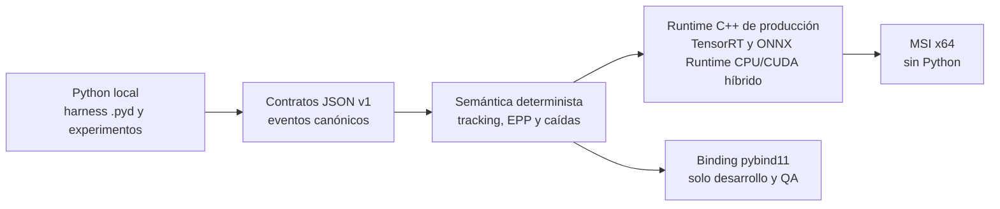
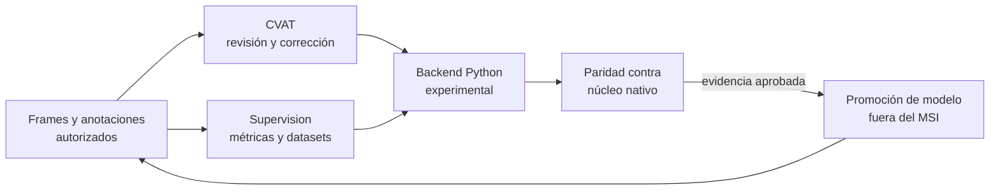
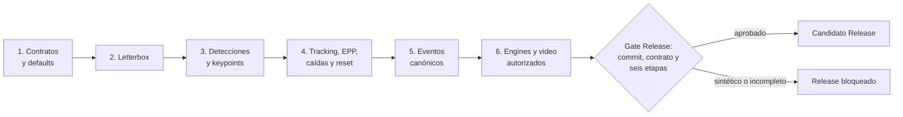

# Acoplamiento Python/C++ para desarrollo y QA

El acoplamiento usa contratos JSON v1 y un binding `pybind11` opcional. La ruta de
producción es MSI aprobado -> NexoAI Vision launcher -> `cuajone_native.exe`; no
depende de Python. La paridad demostrada en el repositorio es sintética y la
paridad de modelos requiere artefactos y material autorizado externos.

## Ruta rápida

1. Compila primero las pruebas CPU nativas.
2. Compila el binding con `CUAJONE_BUILD_PYTHON_BINDINGS=ON` y Python 3.12 en D:.
3. Ejecuta `python -m cuajone_qa parity` sin modelos ni fuentes.
4. Usa `demo` con un fixture sintético o una fuente expresamente autorizada.

## Límites

| Componente | Propósito | Se incluye en el MSI |
| --- | --- | --- |
| `cuajone_native.exe` | Runtime Windows con TensorRT y ONNX Runtime CPU/CUDA híbrido | Sí |
| NexoAI Vision launcher | Inicio y perfiles RTSP seguros de producción | Sí |
| `cuajone_native.pyd` | Binding de desarrollo/QA | No |
| `ppe_reportev2.py` | Harness local del `.pyd` con ONNX fijo, captura y reportes | No |
| `cuajone_qa` | CLI, contratos, demos, adapters y paridad | No |
| `jsonschema` | Validación requerida del runtime Python de QA | No |
| Ultralytics/PyTorch | Backend experimental | No |
| CVAT/Supervision | Integración opcional de anotación/datasets | No |
| Fixtures y recibos de paridad | Evidencia de QA | No |

`ppe_reportev2.py` conserva su import y CLI raíz para pruebas locales, pero no es
entrada oficial de producción ni fallback. Solo orquesta configuración, captura,
`NativeBackend`, evidencia, reportes y cierre. La analítica Ultralytics histórica
se conserva separada en `cuajone_qa/experimental/legacy_ultralytics.py`.



Los contratos y la semántica compartida conectan experimentación y producción;
el binding sirve para comprobar esa frontera, pero no entra al MSI.

## Contratos v1

`contracts/v1/` contiene JSON Schema draft 2020-12 para configuración runtime,
fuentes autorizadas, manifests de engine, resultados de frame y eventos. Todos
exigen `1.0.0`, rechazan campos desconocidos donde corresponde y no admiten
credenciales. Una fuente RTSP se referencia por nombre de variable de entorno; la
URL no forma parte del contrato persistido.

Los números canónicos usan semántica `float32` y serialización fija de hasta seis
decimales en Python y C++. El esquema documenta esa precisión y las pruebas del
binding comparan JSON byte por byte.

Los eventos usan el sobre obligatorio de CloudEvents 1.0. Sus tipos canónicos son:

- `com.cuajone.safety.ppe.violation.v1`;
- `com.cuajone.safety.fall.possible.v1`.

Las evidencias se representan mediante referencia y SHA-256. El sobre no admite
URLs RTSP, userinfo ni campos arbitrarios de contraseña.

La persistencia para operadores tiene un segundo contrato versionado, derivado del
evento canónico sin reconstruir su ID: el
[contrato CSV/evidencia v1](operator-evidence-contract-v1.md). Producción MSI y el
harness Python comparten nombres, orden de 14 campos, tipos de evento y semántica
`SI`/`NO`/`N/D`. La salida nativa es autoritativa. El XLSX existe únicamente como
exportación local/offline para QA y revisión humana; no se genera ni se incluye una
biblioteca Excel en el MSI.

## Binding nativo

El target está desactivado por defecto. Requiere `pybind11==3.0.4` desde un entorno
Python 3.12 alojado bajo `.tools\native` y nunca usa `FetchContent` ni versiona binarios.

```powershell
cmake -S native -B .tools\native\build\coupling-pybind `
  -DCUAJONE_BUILD_RUNTIME=ON `
  -DCUAJONE_BUILD_PYTHON_BINDINGS=ON `
  -DCUAJONE_PYBIND11_ROOT=.tools\native\venvs\coupling-py312\Lib\site-packages\pybind11\share\cmake\pybind11 `
  -DPython_EXECUTABLE=.tools\native\venvs\coupling-py312\Scripts\python.exe
cmake --build .tools\native\build\coupling-pybind --config Release
```

`AnalyticsPipeline` procesa observaciones CPU sintéticas. `EnginePipeline` aparece
solo en builds con runtime y permite QA con engines TensorRT CUDA o modelos ONNX CPU.
El backend debe declararse de forma resuelta como `cuda` o `cpu`; no acepta `auto`.
La entrada NumPy debe
ser `uint8`, BGR, `(alto, ancho, 3)` y C-contigua; no se realizan copias implícitas.
El GIL se libera durante el trabajo C++ síncrono.

En Windows, Python 3.8 o posterior requiere registrar las carpetas DLL mediante
`CUAJONE_NATIVE_DLL_DIRS`; no copies esas DLL al repositorio.

## Demo

El fixture es la única ruta reproducible sin fuentes ni modelos:

```powershell
python -m cuajone_qa demo --backend native --mode ppe-fall `
  --fixture D:\QA\fixture-sintetico.json --headless `
  --jsonl D:\QA\salida\eventos.jsonl
```

Para una fuente autorizada, selecciona `image`, `video`, `webcam` o `rtsp` y aporta
artefactos externos. `native` usa el adapter ByteTrack-Eigen compartido con el ejecutable. El
módulo `cuajone_qa.experimental.legacy_ultralytics` conserva Ultralytics y
ByteTrack solo para experimentos/compatibilidad y requiere el extra explícito:

```powershell
uv sync --locked --extra experimental
```

El facade raíz no importa PyTorch ni Ultralytics. Ninguna ruta nativa abre una
fuente durante importación, `--help` o validación de contratos.

CVAT y Supervision se instalan por separado:

```powershell
uv sync --extra cvat
uv sync --extra supervision
```

El adapter CVAT recibe un cliente SDK y no persiste credenciales. Expone creación
de tareas, export/import y autoanotación; no instala ni inicia un servidor. El
adapter Supervision convierte `sv.Detections`, anota y usa métricas/datasets solo
si la versión instalada ofrece esas APIs.



El ciclo mejora datos y modelos fuera del producto instalado. Ninguna promoción
es automática: exige procedencia, autorización y evidencia de paridad.

## Paridad

El runner compara en orden:

1. contratos y defaults;
2. transformación letterbox observable;
3. detecciones y keypoints canónicos;
4. tracking, EPP, caída y reset deterministas;
5. eventos CloudEvents;
6. hook externo de engines/video autorizado.

El recibo sintético se escribe en D: y declara
`full_model_parity_claimed=false`. No habilita un build `Release`. El gate de
producción exige alcance `authorized-engine-data`, commit y contrato exactos y las
seis etapas aprobadas. El perfil `production_sim` usa ByteTrack-Eigen nativo; el
tracker Ultralytics experimental continúa declarado como no equivalente.

El recibo comparte `contracts/v1/parity-receipt.schema.json` entre Python y
PowerShell. Un Release exige autorización, al menos dos inputs aprobados con
SHA-256, evidencia hash por etapa y comparaciones positivas. El timestamp debe ser
RFC3339 UTC, admite como máximo cinco minutos de desvío futuro y vence a los siete
días; después debe repetirse la paridad autorizada.



Las primeras cinco etapas son reproducibles con fixtures. La sexta es
deliberadamente externa y evita convertir una comparación sintética en una
afirmación de modelo.

La portabilidad hacia cámaras Axis se analiza por separado en la
[evaluación de integrabilidad ACAP](acap-integrability.md); el binario Windows y
el binding no son aplicaciones ACAP.

## Limitaciones

- No se ejecutó inferencia ni se cargaron engines/modelos durante esta integración.
- No se afirma paridad completa, rendimiento, multicámara, Milestone ni ACAP.
- El binding y `ppe_reportev2.py` son desarrollo/QA y no constituyen APIs de producto estables.
- El runtime en vivo conserva el slot de último frame; las llamadas offline al
  pipeline procesan cada frame recibido y exigen orden monotónico.
